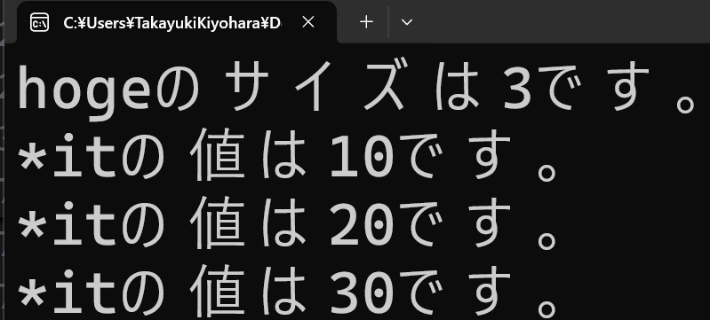
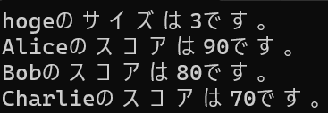
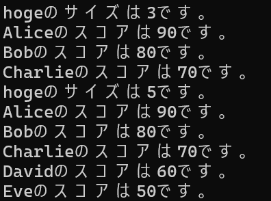

- [Chapter 0 デバッガの利用](#chapter-0-デバッガの利用)
  - [0.1 デバッガありで実行(F5)](#01-デバッガありで実行f5)
  - [0.2 デバッガの停止(shift+F5)](#02-デバッガの停止shiftf5)
  - [0.3 ブレイクポイント(F9)](#03-ブレイクポイントf9)
  - [0.4【ハンズオン】じゃんけんに勝利したときif文の中にブレイクポイントを設置して見よう](#04ハンズオンじゃんけんに勝利したときif文の中にブレイクポイントを設置して見よう)
    - [step-1 ブレイクポイントの設置](#step-1-ブレイクポイントの設置)
    - [step-2 デバッガありで実行](#step-2-デバッガありで実行)
    - [step-3 続行](#step-3-続行)
  - [0.4 ステップオーバー(F10)](#04-ステップオーバーf10)
  - [0.5 ステップイン(F11)](#05-ステップインf11)
  - [0.6 ステップアアウト(Shift + F11)](#06-ステップアアウトshift--f11)
  - [0.7【ハンズオン】ステップオーバー/ステップイン/ステップアウトを試す](#07ハンズオンステップオーバーステップインステップアウトを試す)
    - [step-1 ステップオーバーで63行目までプログラムを進める。](#step-1-ステップオーバーで63行目までプログラムを進める)
    - [step-2 ステップインでDispComNoTe()の中に入る](#step-2-ステップインでdispcomnoteの中に入る)
    - [step-3 ステップオーバーでDispComNoTe()の処理を23行目まで進める](#step-3-ステップオーバーでdispcomnoteの処理を23行目まで進める)
    - [step-4 ステップアウトでDispComNoTe()から抜ける](#step-4-ステップアウトでdispcomnoteから抜ける)
  - [0.8 ウォッチ](#08-ウォッチ)
    - [0.9【ハンズオン】ウォッチを使ってみる](#09ハンズオンウォッチを使ってみる)
    - [0.11 呼び出し履歴](#011-呼び出し履歴)
    - [0.12 【ハンズオン】呼び出し履歴を使ってみる。](#012-ハンズオン呼び出し履歴を使ってみる)
      - [step-1 DispPlayerNoTe()にブレイクポイントを設置する。](#step-1-dispplayernoteにブレイクポイントを設置する)
      - [step-2 ブレイクポイントでプログラムを停止させる。](#step-2-ブレイクポイントでプログラムを停止させる)
      - [step-3 呼び出し履歴を確認する](#step-3-呼び出し履歴を確認する)
    - [0.13 出力](#013-出力)
    - [0.14 【ハンズオン】出力ウィンドウを使ってみる。](#014-ハンズオン出力ウィンドウを使ってみる)
- [Chapter 1 計算量とは](#chapter-1-計算量とは)
  - [1.1 計算量オーダーとは？](#11-計算量オーダーとは)
  - [1.2 代表的な計算量の種類](#12-代表的な計算量の種類)
    - [O(1) : 定数時間](#o1--定数時間)
    - [O(n) : 線形時間](#on--線形時間)
    - [O(log n) : 対数時間](#olog-n--対数時間)
    - [O(n²) : 二次時間](#on--二次時間)
    - [O(n log n) : 線形対数時間](#on-log-n--線形対数時間)
    - [1.3 全探索アルゴリズムを試してみる](#13-全探索アルゴリズムを試してみる)
    - [1.4 二分探索アルゴリズムを試してみる](#14-二分探索アルゴリズムを試してみる)
    - [1.5 バブルソートを試してみる](#15-バブルソートを試してみる)
    - [1.6 マージソートを試してみる](#16-マージソートを試してみる)
- [Chapter 2 Standard Template Library](#chapter-2-standard-template-library)
  - [2.1 Standard Template Libraryとは](#21-standard-template-libraryとは)
  - [2.2 STLの主要な要素](#22-stlの主要な要素)
    - [2.2.1 コンテナ（Containers）](#221-コンテナcontainers)
    - [2.2.2 アルゴリズム（Algorithms）](#222-アルゴリズムalgorithms)
    - [2.2.3 イテレータ（Iterators）](#223-イテレータiterators)
  - [2.3【コンテナ】std::array(セキュアな固定配列)](#23コンテナstdarrayセキュアな固定配列)
    - [2.3.1 std::array（セキュアな固定配列）とは](#231-stdarrayセキュアな固定配列とは)
    - [2.3.2 std::arrayの基本概念](#232-stdarrayの基本概念)
    - [2.3.3 std::arrayの特徴](#233-stdarrayの特徴)
      - [固定サイズで効率的](#固定サイズで効率的)
      - [STLとの親和性](#stlとの親和性)
      - [値セマンティクスに対応](#値セマンティクスに対応)
      - [安全性の高いアクセス](#安全性の高いアクセス)
      - [サイズ情報の保持](#サイズ情報の保持)
    - [2.3.4 std::array vs C言語の生配列（普通の固定長配列）](#234-stdarray-vs-c言語の生配列普通の固定長配列)
    - [2.3.5 std::arrayの操作](#235-stdarrayの操作)
      - [要素アクセス](#要素アクセス)
      - [サイズの取得](#サイズの取得)
      - [初期化と代入](#初期化と代入)
      - [イテレータ取得](#イテレータ取得)
      - [ソート・検索など](#ソート検索など)
    - [2.3.6 まとめ](#236-まとめ)
    - [2.3.7 【ハンズオン】std::arrayを使ってみる](#237-ハンズオンstdarrayを使ってみる)
      - [step-1 arrayをインクルードする](#step-1-arrayをインクルードする)
      - [step-2 int型の要素数5のstd::arrayの変数を定義する](#step-2-int型の要素数5のstdarrayの変数を定義する)
      - [step-3 hogeに値を代入する](#step-3-hogeに値を代入する)
      - [step-4 hogeの値を表示する](#step-4-hogeの値を表示する)
      - [step-5 最後に範囲外アクセスを起こして例外を起こしてみる](#step-5-最後に範囲外アクセスを起こして例外を起こしてみる)
      - [なぜクラッシュする方がセキュアなの？](#なぜクラッシュする方がセキュアなの)
  - [2.4 【コンテナ】std::vector(動的配列)](#24-コンテナstdvector動的配列)
    - [2.4.1 std::vector（動的配列）とは](#241-stdvector動的配列とは)
    - [2.4.2 std::vectorの主な特長](#242-stdvectorの主な特長)
      - [動的なサイズの変更](#動的なサイズの変更)
      - [ランダムアクセス](#ランダムアクセス)
      - [自動メモリ管理](#自動メモリ管理)
    - [2.4.3 自動メモリ管理の注意点](#243-自動メモリ管理の注意点)
      - [メモリの再確保（Reallocation）](#メモリの再確保reallocation)
      - [reserve() の活用](#reserve-の活用)
      - [イテレータの無効化](#イテレータの無効化)
      - [メモリリークのリスク](#メモリリークのリスク)
    - [2.4.4 std::vectorの具体的ないくつかの利用方法](#244-stdvectorの具体的ないくつかの利用方法)
      - [要素の追加](#要素の追加)
      - [サイズの取得](#サイズの取得-1)
      - [要素の削除](#要素の削除)
        - [erase関数の注意点](#erase関数の注意点)
      - [removeイディオムを利用した削除の方法](#removeイディオムを利用した削除の方法)
      - [要素へのアクセス](#要素へのアクセス)
      - [サイズの変更](#サイズの変更)
    - [2.4.6 std::vectorの性能](#246-stdvectorの性能)
    - [2.4.7 まとめ](#247-まとめ)
    - [2.4.8 【ハンズオン】std::vectorを使ってみる](#248-ハンズオンstdvectorを使ってみる)
      - [step-1 vectorをインクルード](#step-1-vectorをインクルード)
      - [step-2 int型の要素を記録できる可変長配列を定義する。](#step-2-int型の要素を記録できる可変長配列を定義する)
      - [step-3 hogeに要素を追加する](#step-3-hogeに要素を追加する)
      - [step-4 hogeのサイズを表示する。](#step-4-hogeのサイズを表示する)
      - [step-5 for文を使って、hogeの要素の値を表示する。](#step-5-for文を使ってhogeの要素の値を表示する)
      - [step-6 さらにhogeに要素を追加する。](#step-6-さらにhogeに要素を追加する)
      - [step-7 再度hogeのサイズを表示する。](#step-7-再度hogeのサイズを表示する)
      - [step-8 もう一度for文を使って、hogeの要素の値を表示する。](#step-8-もう一度for文を使ってhogeの要素の値を表示する)
      - [step-9 指定した要素を削除する](#step-9-指定した要素を削除する)
      - [int型以外も記録できるの？](#int型以外も記録できるの)
    - [2.4.9【実習課題】removeイディオムを利用して要素を削除する](#249実習課題removeイディオムを利用して要素を削除する)
  - [2.5 【コンテナ】std::list(双方向リンクリスト)](#25-コンテナstdlist双方向リンクリスト)
    - [2.5.1 std::list(双方向リンクリスト)とは](#251-stdlist双方向リンクリストとは)
    - [2.5.2 std::listの主な特徴](#252-stdlistの主な特徴)
      - [ランダムアクセス不可](#ランダムアクセス不可)
      - [自動メモリ管理](#自動メモリ管理-1)
    - [2.5.3 自動メモリ管理の注意点](#253-自動メモリ管理の注意点)
      - [ノードごとのメモリ確保と断片化](#ノードごとのメモリ確保と断片化)
      - [イテレータの安定性と削除後の注意](#イテレータの安定性と削除後の注意)
      - [ポインタ格納時のメモリリークリスク](#ポインタ格納時のメモリリークリスク)
    - [2.5.4 std::list の具体的ないくつかの利用方法](#254-stdlist-の具体的ないくつかの利用方法)
      - [要素の追加：push\_back, push\_front, insert](#要素の追加push_back-push_front-insert)
      - [要素の削除：pop\_back, pop\_front, erase, remove](#要素の削除pop_back-pop_front-erase-remove)
      - [サイズの取得：size](#サイズの取得size)
      - [要素へのアクセス：front, back, イテレータ](#要素へのアクセスfront-back-イテレータ)
      - [サイズの変更：resize](#サイズの変更resize)
    - [2.5.5 vectorとlistの違い](#255-vectorとlistの違い)
    - [2.5.6【ハンズオン】std::listを使ってみる](#256ハンズオンstdlistを使ってみる)
      - [step-1 listをインクルード](#step-1-listをインクルード)
      - [step-2 int型の要素を記録できる双方向リンクリストを定義する。](#step-2-int型の要素を記録できる双方向リンクリストを定義する)
      - [step-3 hogeに要素を追加する](#step-3-hogeに要素を追加する-1)
      - [step-4 hogeのサイズを表示する。](#step-4-hogeのサイズを表示する-1)
      - [step-5 for文を使って、hogeの要素の値を表示する。](#step-5-for文を使ってhogeの要素の値を表示する-1)
      - [step-6 さらにhogeに要素を追加する。](#step-6-さらにhogeに要素を追加する-1)
      - [step-7 再度hogeのサイズを表示する。](#step-7-再度hogeのサイズを表示する-1)
      - [step-8 もう一度for文を使って、hogeの要素の値を表示する。](#step-8-もう一度for文を使ってhogeの要素の値を表示する-1)
      - [step-9 Algorithmをインクルードする](#step-9-algorithmをインクルードする)
      - [step-10 指定した要素を削除する](#step-10-指定した要素を削除する)
  - [2.6 【コンテナ】std::map(連想配列)](#26-コンテナstdmap連想配列)
    - [2.6.1 std::mapとは](#261-stdmapとは)
    - [2.6.2 std::mapの主な特徴](#262-stdmapの主な特徴)
      - [💡自動ソートとイテレータによる順序付き走査](#自動ソートとイテレータによる順序付き走査)
      - [🍊要素の検索と削除](#要素の検索と削除)
      - [⛄キーの一意性](#キーの一意性)
    - [2.6.3 自動メモリ管理と注意点](#263-自動メモリ管理と注意点)
      - [🐈キャッシュ効率と構造の複雑さ](#キャッシュ効率と構造の複雑さ)
      - [🐶イテレータの安定性](#イテレータの安定性)
      - [🐵ポインタを格納する場合の注意](#ポインタを格納する場合の注意)
    - [2.6.4 大量のデータの検索](#264-大量のデータの検索)
      - [🔍 他のコンテナとの検索性能比較](#-他のコンテナとの検索性能比較)
      - [🧠 例：10万件のデータを検索する場合](#-例10万件のデータを検索する場合)
      - [📌 注意点](#-注意点)
    - [2.6.5 std::mapの具体的ないくつかの利用方法](#265-stdmapの具体的ないくつかの利用方法)
      - [要素の追加：insert, emplace](#要素の追加insert-emplace)
      - [要素の削除：erase](#要素の削除erase)
      - [要素の検索：find](#要素の検索find)
      - [要素のサイズ取得：size](#要素のサイズ取得size)
      - [要素へのアクセス：at, \[\]](#要素へのアクセスat-)
      - [要素の順序付き走査：イテレータ](#要素の順序付き走査イテレータ)
      - [要素のクリア：clear](#要素のクリアclear)
    - [2.6.6 【ハンズオン】std::mapを使ってみる](#266-ハンズオンstdmapを使ってみる)
      - [step-1 mapをインクルード](#step-1-mapをインクルード)
      - [step-2 std::mapを定義する](#step-2-stdmapを定義する)
      - [step-3 hogeに要素を追加する](#step-3-hogeに要素を追加する-2)
      - [step-4 hogeのサイズを表示する。](#step-4-hogeのサイズを表示する-2)
      - [step-5 for文を使って、hogeの要素の値を表示する。](#step-5-for文を使ってhogeの要素の値を表示する-2)
      - [step-6 さらにhogeに要素を追加する。](#step-6-さらにhogeに要素を追加する-2)
      - [step-7 再度hogeのサイズを表示する。](#step-7-再度hogeのサイズを表示する-2)
      - [step-8 もう一度for文を使って、hogeの要素の値を表示する。](#step-8-もう一度for文を使ってhogeの要素の値を表示する-2)
      - [step-9 指定した要素を削除する](#step-9-指定した要素を削除する-1)

# Chapter 0 デバッガの利用
大規模なC++の開発において、デバッガの利用は欠かせません。</br>
このチャプターではMicrosoft社が提供している統合環境、VisualStudioのデバッガの機能について学んでいきます。</br>

## 0.1 デバッガありで実行(F5)
デバッガを使うためには、プログラムをデバッガありで実行する必要があります。</br>
「デバッガありでの実行」は図0.1のボタンをクリックするか、ショートカットキーのF5を入力することで行えます。</br></br>
**図0.1**</br>
</img></br>

</br>

---
## 0.2 デバッガの停止(shift+F5)

デバッガありで実行開始したプログラムはデバッガの停止ボタンを押すことで停止することができます(図0.2)。</br>
デバッガの停止はショートカットキーのshift+F5でも停止することができます。</br></br>
**図0.2**</br>
</img></br>

</br>

---
## 0.3 ブレイクポイント(F9)
ブレイクポイントを設置することで実行中のプログラムを停止することができます。</br>
プログラムの処理の流れの確認や、後述するウォッチ機能を利用しての変数の値などを行うときに頻繁に利用する機能です。<br>
ブレイクポイントは図0.3のようにプログラムを停止させたい行をマウスでクリックすることで設置することができます。</br>
また、ショートカットキーのF9を入力することでも設置することができます。</br></br>

**図0.3**</br>
</img></br>
ブレイクポイントの解除は、解除したいブレイクポイントをマウスでクリックするかF9を入力することで解除することができます。</br>
また、ブレイクポイントで停止したプログラムを再開するには、図1.4の「続行」をクリックするか、ショートカットキーのF5を入力してください。

</br>

---
## 0.4【ハンズオン】じゃんけんに勝利したときif文の中にブレイクポイントを設置して見よう
じゃんけんゲームのプログラムでデバッガの機能を利用して、勝利したときのif文の処理が正しく実行されているか確認してみましょう。</br>
Sample_00_00/Sample_00_00.slnを立ち上げてください。

### step-1 ブレイクポイントの設置
main.cppの71行目にブレイクポイントを設置してください(図0.5)。</br></br>
**図0.5**</br>
</img></br>

### step-2 デバッガありで実行
プログラムをデバッガありで実行して、じゃんけんゲームをプレイしてみてください。</br>
ブレイクポイントがうまく設置できていると、じゃんけんに勝利したときに図0.6のようにプログラムが停止するようになります。</br></br>
**図0.6**</br>
</img></br>

### step-3 続行
続行ボタンを押してプログラムを続行してください。
</br>

---
## 0.4 ステップオーバー(F10)
ここからは、プログラムのステップを進めるための機能を見ていきます。</br>
まずはステップオーバーです。</br>
ステップオーバーはブレイクポイントで停止させたプログラムを１行進めることができます。</br>
ステップオーバーはメニューの「デバッグ/ステップオーバー」で実行できます(図0.7)。ショートカットキーのF10でも実行できます。</br></br>

**図0.7**</br>
</img></br>
ステップオーバーは関数の中には入らずにステップを進めるため、ステップオーバーと呼ばれます。
</br>

---
## 0.5 ステップイン(F11)
ステップインもプログラムのステップを１行進めるのですが、こちらはステップオーバーとは違い、関数の中に入ることができます。</br>
ステップインはメニューの「デバッグ/ステップイン」で実行できます(図0.8)。</br>
ショートカットキーのF11でも実行できます。</br></br>
**図0.8**</br>
</img></br>
</br>

---
## 0.6 ステップアアウト(Shift + F11)
ステップアウトは関数を抜けることができます。</br>
ステップアウトはメニューの「デバッグ/ステップアウト」で実行できます(図0.9)。</br>
ショートカットキーのshift + F11でも実行できます。</br></br>
**図0.9**</br>
</img></br>
</br>

---
## 0.7【ハンズオン】ステップオーバー/ステップイン/ステップアウトを試す
では、ハンズオンで各種ステップ実行を試してみましょう。</br>
先ほどのハンズオンでじゃんけんに勝利した際にブレイクポイントを設置していると思いますので、</br>
一旦そこのブレイクポイントでプログラムを停止させてからステップ実行をしていきましょう。</br>
では、まずはプログラムをデバッガありで実行して、じゃんけんゲームをプレイして、71行目のブレイクポイントでプログラムを停止させてください。

### step-1 ステップオーバーで63行目までプログラムを進める。

### step-2 ステップインでDispComNoTe()の中に入る

### step-3 ステップオーバーでDispComNoTe()の処理を23行目まで進める

### step-4 ステップアウトでDispComNoTe()から抜ける

</br>

---
## 0.8 ウォッチ

プログラム実行中に、プレイヤーの体力など、変数の値がどうなっているのか確認したい場合があります。</br>
このようなときに使える機能がウォッチです。</br>
ウォッチを使うためには、ブレイクポイントを設置してプログラムを停止させる必要があります。</br>
プログラムが停止すると、その時点での変数の値を確認することができます。</br>
ウォッチはメニューの「デバッグ/ウィンドウ/ウォッチ/ウォッチ1」から開くことができます(図1.10)。</br>
ウォッチを開けると図0.11のように画面下部にウォッチ画面が表示されているはずです。</br></br>

**図0.10**</br>
</img></br>

**図0.11**</br>
</img></br>

ウォッチウィンドウ値を確認したい変数を入力 or ドラッグアンドロップすると、変数の値を確認することができます(図0.12)。</br></br>
**図0.12**</br>
</img></br>

(注意：ウォッチウィンドウはデバッグありで実行中しか表示されないので注意してください。メニューにも出てきません。)

</br>

---
### 0.9【ハンズオン】ウォッチを使ってみる
では、ウォッチを使ってみましょう。</br>
また、じゃんけんゲームをデバッガありで起動してプレイしてください。</br>
するとじゃんけんで勝利したときにプログラムがブレイクポイントで停止すると思いますので、停止したら変数player、comをウォッチに追加して値を確認してください。
</br>

---

### 0.11 呼び出し履歴
関数の呼び出し履歴を確認することができます。</br>
呼び出し履歴は、メニューの「デバッグ/ウィンドウ/呼び出し履歴」を選択すると開くことができます(図0.13)。</br>
</br>

**図0.13**</br>
</img></br>
呼び出し履歴を開くと画面の下の方に、呼び出し履歴のウィンドウが追加されます(図0.14)。</br>
</br>

**図0.14**</br>
</img></br>

呼び出し履歴はブレイクポイントでプログラムを停止しているときに利用することができます。</br>
呼び出し履歴は、関数がどこから呼ばれているのかをコールされてきたのかを確認することができます。</br>
図0.15はDispComNoTe()のブレイクポイントでプログラムが停止しています。</br>
</br>

**図0.15**</br>
</img></br>

このとき、呼び出し履歴を確認すると、DispComNoTe()はmain()から呼ばれていることが分かります。</br>
呼び出し元のプログラムをは、呼び出し元の関数名をダブルクリックすることで確認することができます。</br>
(注意：呼び出し元に戻ったときに、１行ずれているので注意が必要です。)</br>

---
### 0.12 【ハンズオン】呼び出し履歴を使ってみる。
Sample_00_00/Sample_00_00.slnを利用して呼び出し履歴を使ってみましょう。

#### step-1 DispPlayerNoTe()にブレイクポイントを設置する。
DispPlayerNoTe()の10行目にブレイクポイントを設置してください。

#### step-2 ブレイクポイントでプログラムを停止させる。
では、じゃんけんゲームをデバッガありで実行して、プレイして先ほどのブレイクポイントでプログラムを停止させてください。</br>

#### step-3 呼び出し履歴を確認する
プログラムを停止させることができたら、呼び出し履歴をつかって、DispPlayerNoTe()が何行目から呼ばれているか確認してください。</br>

---
### 0.13 出力
プログラムからのコンソール出力を確認することができます。</br>
出力は、メニューの「デバッグ/ウィンドウ/出力」を選択することで開くことができます(図0.16)。</br>

</br>

**図0.16**</br>
</img></br>
開くと画面の下の方に、出力ウィンドウが追加されます(図0.17)。</br></br>

**図0.17**</br>
</img></br>
出力ウィンドウには、プログラムから重要なランタイムのエラーメッセージが出力されている場合があります。</br>
特にDirectXなどでのプログラミングにおいて、動作がおかしいなどの原因不明のエラーが起きた時は、真っ先に出力ウィンドウを調べましょう。</br>
DirectXからエラーメッセージが出力されている場合があります。</br>
君たちのプログラムで出力ウィンドウに値を出力することもできます。</br>
出力ウィンドウへの出力はOutputDebugStringA()を利用します。</br>

```cpp
OutputDebugStringA("Hello world\n");
```
このような機能は、ゲーム実行中にプレイヤーの体力などを確認したいときに利用します。

### 0.14 【ハンズオン】出力ウィンドウを使ってみる。
Sample_00/Sample_00.slnを利用して、出力ウィンドウに値を出力するコードを追加しましょう。</br>
main.cppの89行目にリスト1.1のプログラムを入力してください。</br>
```cpp
//【ハンズオン】出力ウィンドウを使ってみる。
char text[256];
sprintf(text, "player = %d, com = %d\n", player, com);
OutputDebugStringA(text);
```

入力出来たら実行してください。</br>
出力ウィンドウに変数playerとcomの数値が出力されるようになります。


# Chapter 1 計算量とは

## 1.1 計算量オーダーとは？
計算量オーダー（Big-O表記）は、アルゴリズムやプログラムの性能を評価する重要な指標の一つです。特に入力データが大きくなったときに、実行時間やメモリ使用量がどのように増加するかを表現します。ソフトウェア開発や競技プログラミング、情報科学の分野で広く使われています。

## 1.2 代表的な計算量の種類
計算量オーダーにはいくつか代表的な種類があります。以下に主要なものを示します。

### O(1) : 定数時間
入力サイズに関係なく一定時間で終わる。

例）配列の要素を1つ取得

```cpp
const int size = 5;
int arr[size] = {10, 20, 30, 40, 50};

// 配列のインデックス2の要素に定数時間でアクセス
int value = arr[2];

// 結果を出力
std::cout << "配列のインデックス2の要素は: " << value << std::endl;
```

### O(n) : 線形時間
データが増えるとそのまま実行時間が比例して増える。

例）線形探索（全件検索）
```cpp
 // 検索対象の配列と探索する要素（ターゲット値）を定義
int arr[] = {10, 20, 30, 40, 50};
const int size = sizeof(arr) / sizeof(arr[0]);
int target = 40;

// 線形探索の実装
bool found = false;  // ターゲットが見つかったかどうかのフラグ
int index = -1;      // ターゲットの位置（初期値は見つからなかった場合）

// 配列の各要素を順にチェック
for (int i = 0; i < size; i++) {
    if (arr[i] == target) {
        found = true;
        index = i;  // ターゲットを発見した位置を記録
        break;      // ターゲットが見つかったのでループを終了
    }
}

// 結果の出力
if (found) {
    cout << "ターゲット " << target << " は配列のインデックス " << index << " に存在します。" << endl;
} else {
    cout << "ターゲット " << target << " は配列内に存在しません。" << endl;
}
```

### O(log n) : 対数時間
データが倍になるごとに処理回数が1回増える。`O(n)`の計算量のアルゴリズムを改善する場合は`O(log n)`を目指すことになります。
次の図はO(n)とO(log n)の計算量を比較するグラフです。

</img>計算量オーダーを比較するグラフ</br>

`O(n)`の計算量の場合、1000個のデータからの検索で最悪の場合で1000回の計算量になるのですが、`O(log n)`の場合は`log₂(1000)` ≒ `9.97`と最悪の計算量でも10回に満たない計算量になります。
この差はデータ数が増えるとさらに大きく開いていきます。`O(log n)`のアルゴリズムであれば、例えばデータ数が1億個の場合でも`log₂(100,000,000)` ≒ `26.5`とわずか26回の計算量で検索することができます。

例）二分木を使った２分探索

```cpp
#include <iostream>
using namespace std;

// 二分探索木のノード構造体
struct TreeNode {
    int data;
    TreeNode *left;
    TreeNode *right;
    
    // コンストラクタで初期化
    TreeNode(int val) : data(val), left(nullptr), right(nullptr) {}
};

// BST に新しい値を挿入する関数（再帰的に実装）
TreeNode* insert(TreeNode* root, int value) {
    // 空の位置に来たら新しいノードを作成
    if (root == nullptr) {
        return new TreeNode(value);
    }
    // 挿入する値が現在のノードより小さい場合は左部分木へ
    if (value < root->data) {
        root->left = insert(root->left, value);
    }
    // 挿入する値が現在のノードより大きい場合は右部分木へ
    else {
        root->right = insert(root->right, value);
    }
    return root;
}

// BST から指定した値を探索する関数（再帰的に実装）
// 見つかった場合は該当ノードのポインタ、見つからなければ nullptr を返す
TreeNode* search(TreeNode* root, int target) {
    if (root == nullptr || root->data == target) {
        return root;
    }
    // ターゲットが現在のノードより小さい場合は左部分木へ
    if (target < root->data) {
        return search(root->left, target);
    }
    // ターゲットが現在のノードより大きい場合は右部分木へ
    return search(root->right, target);
}

int main() {
    TreeNode* root = nullptr;
    
    // BST の構築
    int values[] = {30, 20, 40, 10, 25, 35, 50};
    int n = sizeof(values) / sizeof(values[0]);
    for (int i = 0; i < n; i++) {
        root = insert(root, values[i]);
    }
    
    // 探索する値の設定
    int target = 25;
    TreeNode* foundNode = search(root, target);
    
    if (foundNode != nullptr) {
        cout << "値 " << target << " は二分探索木内に存在します（ノードの値: " 
             << foundNode->data << "）。" << endl;
    } else {
        cout << "値 " << target << " は二分探索木内に存在しません。" << endl;
    }
    
    // 簡単なサンプルのため、動的確保したメモリの解放は省略しています。
    return 0;
}
```

2分木のデータ構造は次のようになります。左側には木のルート（30）より小さい数値が記憶されています。右側には30より大きい数値が記憶されています。

```
          30
         /  \
       20    40
      /  \   / \
    10   25 35  50
```

このデータ構造から25という数値を検索する場合は、次のような流れになります。

```
                   [30]
                    |
         ------------------------
         |                      |
        (25 < 30)           (不採用)
         |                      
       [20]
         |
  -----------------
  |               |
(不採用)        [25] <- ターゲット発見
  |               |
(10)           (結果成立)

```
このように、一度の比較で半分の要素を検索対象から破棄することができるため、非常に大きなデータベースに対して検索をかけるときに最良のアルゴリズムとなります。

### O(n²) : 二次時間
O(n²) というのは、「処理にかかる時間が、データ数の2乗に比例して増えていきます。

n が 2 → かかる量は 2² = 4 回分
n が 10 → 10² = 100 回分
n が 100 → 100² = 10,000 回分！
n が 1000 → 1000² = 1,000,000 回分！！

このようにデータ数が少ないときは問題は起きないのですが、データ量が増えていくと爆発的に計算量が増加していくため注意が必要なアルゴリズムです。
この処理を改善する場合は`O( n log n)`の計算量を目指していくことになります。

例）2重ループ、バブルソート
```cpp
// バブルソート関数
void bubbleSort(int arr[], int n) {
    for (int i = 0; i < n - 1; i++) {
        // 最後の i 個は既にソート済みなので無視してOK
        for (int j = 0; j < n - i - 1; j++) {
            // 隣同士を比較して入れ替え
            if (arr[j] > arr[j + 1]) {
                // swap
                int temp = arr[j];
                arr[j] = arr[j + 1];
                arr[j + 1] = temp;
            }
        }
    }
}
```

### O(n log n) : 線形対数時間
現実的に最速のソートアルゴリズムの計算量。`O(n²)`のアルゴリズムを改善する場合は`o( n log n)`を目指すこととなります。
下記の図は`O(n²)`と`o( n log n)`の計算量を比較するグラフです。

</img>計算量オーダーを比較するグラフ</br>

`O(n²)`（青線）は、nが1000に近づくと計算量は100万まで到達しています。
一方`o( n log n)`は`log₂(1000)×1000` ≒ `9965.7`となり計算量が1/100程度の計算量となっています。

例）マージソート
```cpp
// 配列をマージする関数（2つのソート済み部分を1つに統合）
void merge(int arr[], int left, int mid, int right) {
    int n1 = mid - left + 1;  // 左側の長さ
    int n2 = right - mid;     // 右側の長さ

    // 一時配列を作成
    int L[n1], R[n2];

    // 左右に値をコピー
    for (int i = 0; i < n1; i++) L[i] = arr[left + i];
    for (int j = 0; j < n2; j++) R[j] = arr[mid + 1 + j];

    // マージ処理
    int i = 0, j = 0, k = left;
    while (i < n1 && j < n2) {
        if (L[i] <= R[j]) {
            arr[k++] = L[i++];
        } else {
            arr[k++] = R[j++];
        }
    }

    // 残り要素をコピー（どちらか片方のみ）
    while (i < n1) arr[k++] = L[i++];
    while (j < n2) arr[k++] = R[j++];
}

// 再帰的にマージソートを行う関数
void mergeSort(int arr[], int left, int right) {
    if (left < right) {
        int mid = left + (right - left) / 2;

        // 左右に分割
        mergeSort(arr, left, mid);
        mergeSort(arr, mid + 1, right);

        // マージ（統合）
        merge(arr, left, mid, right);
    }
}
```

マージソートのイメージは下記のようになります。

```
[5, 3, 8, 4, 2, 6]   ← 元の配列
 ├── [5, 3, 8]       ← 左半分
 │    ├── [5]        ← 再帰的に分割
 │    └── [3, 8]
 │         ├── [3]
 │         └── [8]
 │         → [3, 8]  ← ソートしてマージ
 │    → [3, 5, 8]    ← ソートしてマージ
 └── [4, 2, 6]       ← 右半分
      ├── [4]
      └── [2, 6]
           ├── [2]
           └── [6]
           → [2, 6]  ← ソートしてマージ
      → [2, 4, 6]    ← ソートしてマージ

→ [2, 3, 4, 5, 6, 8] ← 最終的にマージして完成
```

### 1.3 全探索アルゴリズムを試してみる

Sample_01_00/Sample_01_00.slnを開いて全探索アルゴリズムの`O(n)`の計算時間を確認してみてください。

### 1.4 二分探索アルゴリズムを試してみる
Sample_01_01/Sample_01_01.slnを開いて二分探索アルゴリズムの`O(log n)`の計算時間を確認してみてください。

### 1.5 バブルソートを試してみる
Sample_01_02/Sample_01_02.slnを開いてアルゴリズムの`O(n²)`の計算時間を確認してみてください。

### 1.6 マージソートを試してみる
Sample_01_03/Sample_01_03.slnを開いてアルゴリズムの`O(n log n )`の計算時間を確認してみてください。

# Chapter 2 Standard Template Library

## 2.1 Standard Template Libraryとは
C++の`Standard Template Library（STL）`は、C++の標準ライブラリの一部で、データ構造やアルゴリズムを効率的に提供するために設計された汎用的なテンプレートライブラリです。`STL`は、プログラムの効率性や再利用性を高めるために、多くの便利なコンテナ、アルゴリズム、イテレータを提供しています。`STL`は、C++のプログラミングの強力な要素の一つであり、特に複雑なデータ構造やアルゴリズムを手軽に利用できる点で大きな利点を持っています。

## 2.2 STLの主要な要素
STLは、以下の主要な3つのコンポーネントから構成されています。

### 2.2.1 コンテナ（Containers）
コンテナはデータを格納するためのオブジェクトで、STLには様々な種類のコンテナが存在します。主なコンテナは以下の通りです：


セキュアな固定長配列(`std::array`) : セキュアな固定長配列で、C言語の生配列のように扱うことができます。

ベクター（`std::vector`）: 動的配列であり、サイズが変更可能なコンテナです。ランダムアクセスが高速で、要素の追加・削除が効率的です。

リスト（`std::list`）: 双方向リンクリストです。要素の挿入や削除は高速ですが、ランダムアクセスには向いていません。

デック（`std::deque`）: 両端キューで、両端からの要素の追加・削除が効率的です。中央の要素にはランダムアクセスできます。

セット（`std::set`）: 重複しない要素を保持する集合です。要素は自動的にソートされ、検索、挿入、削除が効率的に行えます。

マップ（`std::map`）: キーと値のペアを保持する連想コンテナです。キーがソートされ、効率的に検索や挿入が行えます。

スタック（`std::stack）`: LIFO（後入れ先出し）方式のコンテナです。`push`や`pop`の操作が高速です。

キュー（`std::queue`）: FIFO（先入れ先出し）方式のコンテナで、`push`と`pop`操作が効率的です。

### 2.2.2 アルゴリズム（Algorithms）
`STL`には、コンテナの要素を操作するためのアルゴリズムも多数提供されています。これらのアルゴリズムは、コンテナと独立して動作し、再利用可能なコードを提供します。代表的なアルゴリズムには以下が含まれます：

ソート（`std::sort`）: コンテナ内の要素をソートするアルゴリズムです。

検索（`std::find`）: コンテナ内の要素を検索します。

コピー（`std::copy`）: コンテナの要素を別の場所にコピーします。

変換（`std::transform`）: コンテナ内の各要素に対して関数を適用するアルゴリズムです。

合計（`std::accumulate`）: コンテナ内の要素の合計を計算するアルゴリズムです。

これらのアルゴリズムは、C++の汎用的な操作を提供し、コンテナの種類に依存せず、異なるデータ構造で同じ操作を実行できるように設計されています。

### 2.2.3 イテレータ（Iterators）
イテレータは、STLコンテナの要素を反復処理するためのオブジェクトです。イテレータはポインタのように振る舞い、コンテナの各要素を順番にアクセスするために使用されます。イテレータを使用することで、アルゴリズムとコンテナが密結合せずに、汎用的なコードを書くことができます。

イテレータには主に以下の種類があります：

入力イテレータ: 順方向に1回だけ読み取ることができます。

出力イテレータ: 順方向に1回だけ書き込むことができます。

双方向イテレータ: 順方向・逆方向に読み書きできます。

ランダムアクセスイテレータ: ポインタと同じように任意の位置にランダムアクセスできます。


## 2.3【コンテナ】std::array(セキュアな固定配列)

### 2.3.1 std::array（セキュアな固定配列）とは
`std::array`は、C++11から導入されたSTL（Standard Template Library）の一部で、固定サイズの配列をラップしたテンプレートクラスです。C言語の配列（int arr[10]など）のように、サイズが固定されている点は同じですが、STLコンテナの一つとして設計されているため、より安全で直感的な操作が可能になっています。Cスタイル配列では、要素数を超えたアクセスをしてもコンパイルエラーにならず、実行時エラーや未定義動作の原因になることがありますが、`std::array`はそのようなミスを減らす機能を持っています。また、`std::array`はSTLアルゴリズムとの相性も良く、範囲for文や`std::sort`、`std::accumulate`などを自然に使うことができます。


### 2.3.2 std::arrayの基本概念
`std::array`は、テンプレートとして定義されており、std::array<T, N>のように使います。ここでTは要素の型、Nは要素数です。たとえば、`std::array<int, 5>`は、5個のint型要素を持つ固定配列です。これは内部的にT arr[N]というCスタイル配列を保持していますが、それに加えてSTL互換のインターフェースが提供されている点が大きな違いです。

初期化は次のように記述できます。
```cpp
std::array<int, 3> arr = {1, 2, 3};
```
要素へのアクセスは、`arr[0]`や`arr.at(0)`で可能です。`at()`を使うと、範囲外アクセスに対して例外（`std::out_of_range`）が投げられるため、安全性が向上します。

### 2.3.3 std::arrayの特徴
#### 固定サイズで効率的
`std::array`はサイズがコンパイル時に確定するため、動的メモリ確保が発生せず、高速かつメモリ効率が良いです。

#### STLとの親和性
`std::begin()`や`std::end()`といった関数が使えるので、`std::sort(arr.begin(), arr.end())`のようなSTLアルゴリズムと自然に組み合わせることができます。

#### 値セマンティクスに対応
　Cスタイル配列とは異なり、`std::array`はコピーや代入、関数の引数・戻り値として利用可能です。

#### 安全性の高いアクセス
`at()`メソッドを使うことで、範囲外アクセスに対して例外処理を適用できます。

#### サイズ情報の保持
C配列とは異なり、`arr.size()`で要素数を取得できます。

### 2.3.4 std::array vs C言語の生配列（普通の固定長配列）
さて、`std::array`はC言語の生配列と同等の振る舞いをし、かつセキュアな操作や便利な関数を保持しています。では、`std::array`とC言語の配列とでパフォーマンス的な差はあるのでしょうか？

結論から言うと実質的なパフォーマンス差はほぼなく、最適化されれば`std::array`とC配列は同等のパフォーマンスになります。
理由としては、`std::array`はC言語の配列のラッパーに過ぎないため、最適化されると普通の配列と同等のコードが出力されます。

`std::array<T, N>`の内部実装は、ざっくり言うと下記のようになっています。
```cpp
template<typename T, std::size_t N>
struct array {
    T elems[N];
};
```

つまり、中身は完全にC配列。余計なポインタやヒープメモリは使われません。
`std::array`の各種関数もテンプレート関数となっているため、全てインライン展開され関数呼び出しのオーバーヘッドも存在しません。


### 2.3.5 std::arrayの操作
`std::array`は以下のような操作が可能です。

#### 要素アクセス
`arr[i]`、`arr.at(i)`を利用することでアクセスできます。

```cpp
#include <array>
#include <iostream>

int main() {
    std::array<int, 3> arr = {10, 20, 30};

    std::cout << "arr[0]: " << arr[0] << std::endl;         // インデックスアクセス
    std::cout << "arr.at(1): " << arr.at(1) << std::endl;   // 範囲チェック付き
    return 0;
}

```

#### サイズの取得
`arr.size()`で要素数を取得できます。
```cpp
#include <array>
#include <iostream>

int main() {
    std::array<int, 5> arr = {1, 2, 3, 4, 5};

    std::cout << "size(): " << arr.size() << std::endl;
    return 0;
}
```

#### 初期化と代入
配列全体を`arr.fill(value)`で一括代入したり、コピーや代入演算子で別の配列と交換したりできます。
```cpp
#include <array>
#include <iostream>

int main() {
    std::array<int, 4> arr;
    arr.fill(42);  // すべての要素に42を代入

    std::array<int, 4> arr2 = {1, 2, 3, 4};
    arr = arr2;  // 配列の代入

    for (int val : arr) {
        std::cout << val << " ";
    }

    return 0;
}

```

#### イテレータ取得
`arr.begin()`、`arr.end()`、`arr.rbegin()`（逆順）など、通常のSTLイテレータ操作が可能です。
```cpp
#include <array>
#include <iostream>

int main() {
    std::array<int, 3> arr = {100, 200, 300};

    // 通常のイテレータ
    for (auto it = arr.begin(); it != arr.end(); ++it) {
        std::cout << *it << " ";
    }
    std::cout << std::endl;

    // 逆順のイテレータ
    for (auto rit = arr.rbegin(); rit != arr.rend(); ++rit) {
        std::cout << *rit << " ";
    }

    return 0;
}
```

#### ソート・検索など
STLのアルゴリズムをそのまま使用可能です。

```cpp
std::sort(arr.begin(), arr.end());
auto it = std::find(arr.begin(), arr.end(), 3);

```
### 2.3.6 まとめ
`std::array`は、C++における「固定長配列の安全で効率的な使い方」を提供する重要なツールです。C配列のような軽さを保ちつつ、STLの恩恵（イテレータ、安全なアクセス、値セマンティクスなど）を享受できるため、多くの場面で活用できます。ただし、サイズが固定されている点は変えられない制約なので、用途に応じて`std::vector`などとの使い分けが重要です。使い慣れることで、より安全かつ効率的なコードを書く手助けとなります。

### 2.3.7 【ハンズオン】std::arrayを使ってみる
では`std::array`を利用するハンズオン演習を行っていきましょう。
Sample_02_00/Sample_02_00.slnを開いてmain.cppを開いてください。
#### step-1 arrayをインクルードする
まずは、std::arrayを利用するためにはarrayをインクルードする必要があります。
下記のコードを該当するコメントの箇所に入力してください。
```cpp
// step-1 arrayをインクルードする
#include <array>
```
#### step-2 int型の要素数5のstd::arrayの変数を定義する
続いて、std::array型の変数hogeを定義します。
下記のコードを入力してください。
```cpp
// step-2 int型の要素数5のstd::arrayの変数を定義する
std::array<int, 5> hoge;
```

#### step-3 hogeに値を代入する
hogeの定義ができたので、hogeに値を代入しましょう。
次のコードを入力してください。
なお、ここでは要素のアクセスにC言語の生配列と同等の書き方ができる添え字演算子を利用しています。
```cpp
// step-3 hogeに値を代入する
hoge[0] = 10;
hoge[1] = 20;
hoge[2] = 30;
hoge[3] = 40;
hoge[4] = 50;
```

#### step-4 hogeの値を表示する
続いてhogeの値を表示しましょう。
```cpp
 // step-4 hogeの値を表示する
 for (int i = 0; i < hoge.size(); i++) {
     std::cout << hoge[i] << "\n";
 }
```
#### step-5 最後に範囲外アクセスを起こして例外を起こしてみる
最後に、このコードは不具合を生みますがhogeに対して不正なアクセスを起こすコードを書いてみましょう。
このコードは実行時に範囲外アクセスの例外をだしてクラッシュします（Debugモード時のみ）。
```cpp
// step-5 最後に範囲外アクセスを起こして例外を起こしてみる。
hoge[5] = 10;
```

#### なぜクラッシュする方がセキュアなの？
さて、最後にあえてクラッシュするコードを記述しましたが、なぜクラッシュする方が安全なのでしょうか？
クラッシュされると逆に困るんじゃない？クラッシュしない方がいいんじゃない？と思った人も多いと思います。
C言語の生配列を使っていると、このような場面でクラッシュしないかもしれません。しかし、多くの場面ではクラッシュしない方が大きな問題となります。

クラッシュしないということは、プログラムがエラーに気づかずにそのまま実行を続けてしまうということを意味します。これは、バグが隠れたまま動作し続ける可能性があり、後になって別の箇所で予期しない挙動や深刻なセキュリティホールにつながる危険性があります。特に配列の範囲外アクセスでは、他の重要なメモリ領域に不正にアクセスしてしまうことがあり、たとえば未定義動作を引き起こしたり、意図しないデータを壊したりする原因になります。

一方で、std::array::at()のような安全なメソッドを使えば、範囲外アクセス時に即座にstd::out_of_range例外が発生し、プログラムを強制終了させることができます。これは「失敗に早く気づく」ための設計であり、デバッグの段階で問題の存在を明らかにしやすくなります。また、例外をキャッチして適切に処理することもできるため、制御された方法で安全に失敗させることが可能です。

つまり、「クラッシュ＝悪」ではなく、「黙って誤動作する方がもっと悪」なのです。
その意味で、std::arrayのようなモダンなC++の機能は、開発者がより安全で堅牢なコードを書くための強力な道具となります。安全性を犠牲にして一見うまく動いているように見えるコードよりも、問題があれば即座に検出・対応できるコードの方が、結果的にセキュアで信頼性の高いシステムを構築できます。

## 2.4 【コンテナ】std::vector(動的配列)

### 2.4.1 std::vector（動的配列）とは

C++のStandard Template Library（STL）の`std::vector`は、動的配列（可変長配列）を実現するためのコンテナです。`std::vector`は、サイズが変更可能な配列として、多くのC++プログラムで使用されています。その主な特徴は、要素数が動的に変化でき、追加や削除が効率的に行えることです。また、ランダムアクセスが高速で、メモリ管理が内部で自動的に行われるため、非常に便利で使いやすいデータ構造です。

### 2.4.2 std::vectorの主な特長
#### 動的なサイズの変更
`std::vector`の最も重要な特徴は、要素数を動的に変更できる点です。初期状態では、`std::vector`は空の状態で作成され、必要に応じて要素を追加していくことができます。要素を追加する際に、内部でメモリが再割り当てされることがあります。

```cpp
std::vector<int> vec;  // 空のベクターを作成
vec.push_back(10);      // 10をベクターに追加
vec.push_back(20);      // 20をベクターに追加
```

#### ランダムアクセス
`std::vector`の要素は、配列と同じようにインデックスを使ってランダムアクセスすることができます。これは、`std::vector`が連続したメモリ領域に要素を格納しているため、インデックス指定で高速にアクセスできるからです。

```cpp
std::vector<int> vec = {1, 2, 3, 4, 5};
std::cout << vec[2] << std::endl;  // 3が出力される
```
ランダムアクセスの時間計算量はO(1)で、非常に高速です。


#### 自動メモリ管理
`std::vector`は、メモリを自動的に管理します。開発者は、`push_back`などで要素を追加したり、`resize`でサイズを変更したりする際に、メモリの管理について心配する必要はありません。内部で必要なメモリを確保・解放し、最適化も行われます。

例えば、要素数が多くなると、`std::vector`は内部の配列のサイズを倍増させて新しいメモリを確保し、要素をコピーします。これにより、頻繁にサイズ変更が必要な場合でも、効率的にメモリが管理されます。

### 2.4.3 自動メモリ管理の注意点

`std::vector`は自動的にメモリを確保・解放するコンテナであり、動的配列として振る舞います。
要素数が増加するとメモリの再確保（リサイズ）が行われるため、手動でのメモリ管理が不要ですが、
いくつかの注意点があります。
#### メモリの再確保（Reallocation）
`std::vector`は要素を追加 (`push_back` や `emplace_back`) する際に、必要に応じて新しいメモリ領域を確保し、既存要素を移動します。
例えば、容量が足りなくなると、新しい容量を確保し、すべての要素を新しい領域へコピーします。
これはコストが高くなる可能性があります。

例えば、次のようなコードを考えてみましょう。
```cpp
std::vector<int> hoge;
hoge.push_back(1);
hoge.push_back(2);
hoge.push_back(3);
hoge.push_back(4);
hoge.push_back(5);
```

この場合、再確保とコピーは次のように行われます。

**初期状態**
```
size = 0, capacity = 0

[  ] ← 空。まだメモリ確保されていない
```

**１回目のpush_back**
```
容量が足りない → 新しい配列を作る（capacity = 1）

旧: [  ]
新: [1]
     ↑ コピー & 追加

size = 1, capacity = 1
```

**２回目のpush_back**
```
容量が足りない → 新しい配列を作る（capacity = 2）

旧: [1]
新: [1, 2]
     ↑ コピー   ↑ 追加

size = 2, capacity = 2
```

**3回目のpush_back**
```
容量が足りない → 新しい配列を作る（capacity = 4）

旧: [1, 2]
新: [1, 2, 3, _]
     ↑ コピー   ↑ 追加

size = 3, capacity = 4
```

**4回目のpush_back**
```
容量あり → コピー不要、そのまま追加

現: [1, 2, 3, 4]
                  ↑ 追加

size = 4, capacity = 4
```

**5回目のpush_back**
```
容量が足りない → 新しい配列を作る（capacity = 8）

旧: [1, 2, 3, 4]
新: [1, 2, 3, 4, 5, _, _, _]
     ↑ コピー           ↑ 追加

size = 5, capacity = 8
```

**まとめ（capacityとコピーの流れ）**

```cpp
push_back: 1 → capacity: 0 → 1（再確保・コピー）
push_back: 2 → capacity: 1 → 2（再確保・コピー）
push_back: 3 → capacity: 2 → 4（再確保・コピー）
push_back: 5 → capacity: 4 → 8（再確保・コピー）
```

#### reserve() の活用
追加する要素数が事前にわかっている場合、reserve(n) を使って容量を確保すると、再確保の回数を減らせるため、パフォーマンス向上につながります。
```cpp
std::vector<int> vec;
vec.reserve(1000);  // 1000個の要素分のメモリを確保
```

#### イテレータの無効化
メモリの再確保が発生すると、既存の要素が新しいメモリ領域に移動するため、以前のポインタやイテレータは無効化 されます。再確保後に無効なイテレータを使用すると 未定義動作 となるので注意が必要です。
```cpp
std::vector<int> vec = {1, 2, 3};
auto it = vec.begin();
vec.push_back(4);  // 再確保の可能性あり
// *it は未定義動作になる可能性がある
```

#### メモリリークのリスク
`std::vector`に ポインタを格納 する場合は、明示的なメモリ解放が必要 です。`vector`自体はポインタを管理しないため、ポインタの指すオブジェクトは解放されません。

```cpp
std::vector<int*> ptrs;
ptrs.push_back(new int(10));
ptrs.push_back(new int(20));

// メモリリークを防ぐために解放する
for (int* p : ptrs) {
    delete p;
}
ptrs.clear();
```
このような問題は`std::unique_ptr`などのスマートポインタを利用することで回避することができます。
```cpp
std::vector<std::unique_ptr<int>> ptrs;
ptrs.push_back(std::make_unique<int>(10)); // 自動的に管理される
```

### 2.4.4 std::vectorの具体的ないくつかの利用方法
#### 要素の追加
std::vectorに要素を追加する方法にはいくつかあります。最もよく使われるのはpush_backです。push_backはベクターの末尾に要素を追加します。

```cpp
std::vector<int> vec;
vec.push_back(10);  // ベクターの末尾に10を追加
vec.push_back(20);  // ベクターの末尾に20を追加
```
push_backは要素を1つずつ追加しますが、内部でメモリ再確保を行うこともあります。

#### サイズの取得
std::vectorはstd::arrayと同様にサイズを取得するsizeが用意されています。
```cpp
std::vector<int> vec;
vec.push_back(10);
vec.push_back(20);

int size = vec.size();
std::cout << size << std::endl; // 2と表示される。
```
#### 要素の削除
要素を削除する方法として、`pop_back`を使用します。`pop_back`はベクターの末尾から要素を削除します。
```cpp
vec.pop_back();  // ベクターの末尾の要素を削除
```
また、特定の位置の要素を削除する場合は、eraseを使用します。
```cpp
vec.erase(vec.begin() + 2);  // 3番目の要素を削除
```
##### erase関数の注意点

std::vectorのerase()は、指定した要素を削除すると、その要素以降のすべての要素が前に詰められ、元のイテレーターは無効になります。
無効になったイテレーターを使い続けると、**未定義動作(バグやクラッシュ)** になります。

**危険なコード（NG）**
```cpp
#include <vector>
#include <iostream>

int main() {
    std::vector<int> vec = {1, 2, 3, 4, 5};

    for (auto it = vec.begin(); it != vec.end(); ++it) {
        if (*it % 2 == 0) {
            vec.erase(it);  // ❌ itが無効になる
        }
    }

    // 未定義動作：無効なイテレーターでループを続けてしまう
}
```

**安全なコード(eraseの戻り値を使う)**
```cpp
#include <vector>
#include <iostream>

int main() {
    std::vector<int> vec = {1, 2, 3, 4, 5};

    for (auto it = vec.begin(); it != vec.end(); ) {
        if (*it % 2 == 0) {
            it = vec.erase(it);  // ✅ eraseの戻り値でイテレーターを更新
        } else {
            ++it;
        }
    }

    for (int v : vec) {
        std::cout << v << " ";
    }

    return 0;
}
```

#### removeイディオムを利用した削除の方法
下記のようなコードを書くことで、先ほどのeraseと同等の処理を安短いコードで書くこともできます。
```cpp
auto new_end = std::remove_if(vec.begin(), vec.end(),
                              [](int x) { return x % 2 == 0; });
vec.erase(new_end, vec.end());
```


#### 要素へのアクセス

`std::vector`の要素には、インデックスを使ってアクセスできます。インデックス演算子（[]）を使うことで、直接アクセスできます。

```cpp
std::vector<int> vec = {1, 2, 3, 4, 5};
std::cout << vec[0] << std::endl;  // 1が出力される
```
また、安全にアクセスする場合には、`at`メソッドを使用します。`at`はインデックスが範囲外の場合に例外（`std::out_of_range`）を投げるため、安全性が確保されます。

```cpp
std::cout << vec.at(2) << std::endl;  // 3が出力される
```

#### サイズの変更
`std::vector`のサイズを変更するためには、`resize`メソッドを使用します。`resize`を使うと、指定したサイズにベクターを変更できます。
```cpp
vec.resize(7);  // ベクターのサイズを7に変更（不足分はデフォルト値で埋められる）
```
`resize`を使うと、必要に応じて要素が追加されますが、指定したサイズが現在のサイズよりも小さい場合は、末尾の要素が削除されます。

### 2.4.6 std::vectorの性能
`std::vector`は、動的配列のため、要素の追加や削除に関して非常に効率的です。特に末尾への追加は非常に高速で、ほとんどのケースで定数時間（O(1)）で行えます。しかし、途中の位置に挿入や削除を行う場合は、他の要素をシフトする必要があるため、性能が低下します。これにより、挿入や削除の計算量はO(n)となります。

また、`std::vector`は、要素のランダムアクセスが非常に高速であるため、アクセス時間はO(1)となり、大規模なデータでも高速にアクセスできます。

### 2.4.7 まとめ
`std::vector`は、C++のSTLコンテナの中でも非常に多くの場面で利用される、柔軟で強力なデータ構造です。動的配列として、サイズが変更可能であり、ランダムアクセスが高速です。要素の追加や削除も効率的に行え、メモリ管理が自動で行われるため、開発者にとって非常に扱いやすいコンテナです。`std::vector`は、特にサイズ変更が頻繁に発生する場合や、大規模なデータの操作が必要な場合に非常に有用です。

### 2.4.8 【ハンズオン】std::vectorを使ってみる
では、`std::vector`を使ってみましょう。Sample_02_01を立ち上げてください。
立ち上がったら、main.cppを開いてください。

#### step-1 vectorをインクルード
vectorを利用するためには、まずインクルードを行う必要があります。main.cppにリスト2.1のプログラムを入力してください。</br>
[リスト2.1]</br>

```cpp
//step-1 vectorをインクルード
#include <vector>
```

#### step-2 int型の要素を記録できる可変長配列を定義する。
続いて、int型の要素を記録できる可変長配列を定義します。main.cppにリスト2.2のプログラムを入力してください。</br>
[リスト2.2]</br>

```cpp
//step-2 int型の要素を記録できる可変長配列を定義する。
std::vector<int> hoge;
```

#### step-3 hogeに要素を追加する
続いて、hogeに要素を追加します。要素の追加はpush_back()関数を利用します。main.cppにリスト2.3のプログラムを入力してください。</br>
[リスト2.3]</br>

```cpp
//step-3 hogeに要素を追加する
hoge.push_back(10); //配列の末尾に10を追加する。
hoge.push_back(20); //配列の末尾に20を追加する。
hoge.push_back(30); //配列の末尾に30を追加する。
```

#### step-4 hogeのサイズを表示する。
さて、step-3でhogeにint型のデータを3つ追加しました。ですので、可変長配列hogeのサイズは3になっているはずです。可変長配列のサイズはsize()関数で取得することができます。</br>
では、本当にhogeのサイズが3になっているか確認してみましょう。main.cppにリスト2.4のプログラムを入力して下さい。
[リスト2.4]</br>

```cpp
//step-4 hogeのサイズを表示する。
std::cout << "hogeのサイズは" << hoge.size() << "です。\n";
```

#### step-5 for文を使って、hogeの要素の値を表示する。
可変長配列は、固定長配列と同じように添え字演算子、[]を利用してアクセスすることができます。では、for文で回して、hogeの各要素を表示してみましょう。</br>
main.cppにリスト2.5のプログラムを入力してください。</br>
[リスト2.5]</br>

```cpp
//step-5 for文を使って、hogeの要素の値を表示する。
for (int i = 0; i < hoge.size(); i++) {
    std::cout 
        << "hoge["
        << i 
        << "]の値は" 
        << hoge[i] 
        << "です。\n";
}
```

では、ここまでで一度実行してみて下さい。図2.2のように表示されていたら実装できています。</br>
[図2.2]</br>
</img></br>

#### step-6 さらにhogeに要素を追加する。
step-6では更にhogeに要素を追加してみましょう。main.cppにリスト2.6のプログラムを入力して下さい。</br>
[リスト2.6]</br>

```cpp
//step-6 さらにhogeに要素を追加する。
hoge.push_back(40);
hoge.push_back(50);
```

#### step-7 再度hogeのサイズを表示する。
step-6でhogeに要素を２つ追加したので、hogeの要素数は5になっているはずです。では、再度hogeのサイズを表示するプログラムを追加しましょう。</br>
main.cppにリスト2.7のプログラムを入力してください。</br>
[リスト2.7]
```cpp
//step-7 再度hogeのサイズを表示する。
std::cout << "hogeのサイズは" << hoge.size() << "です。\n";
```

#### step-8 もう一度for文を使って、hogeの要素の値を表示する。
では、最後にもう一度for文を使ってhogeの要素の値を表示してみましょう。main.cppにリスト2.8のプログラムを入力してください。</br>
[リスト2.8]
```cpp
//step-8 もう一度for文を使って、hogeの要素の値を表示する。
for (int i = 0; i < hoge.size(); i++) {
    std::cout
        << "hoge["
        << i
        << "]の値は"
        << hoge[i]
        << "です。\n";
}
```

入力出来たら実行してみてください。図2.3のように表示されていたら実装できています。</br>
[図2.3]</br>
</img></br>

#### step-9 指定した要素を削除する
では、最後にユーザーが入力した数値のデータを削除するプログラムを実装しましょう。
ここでは、erase関数を利用しています。
erase関数を利用した際にイテレーターが無効になる問題を意識しながらコードを入力してください。

```cpp
//step-9 指定した要素を削除する
int target;
std::cout << "削除したい数値を入力してください\n";
std::cin >> target;
// 削除する要素を指しているイテレーターを検索する
for (
    std::vector<int>::iterator it = hoge.begin();
    it != hoge.end();
    ) {
    if (*it == target) {
        // 見つかったので削除。
        // 戻り値は新しい次のイテレーターを返してくる。
        it = hoge.erase(it);
    }
    else {
        // ターゲットではなかったので次
        it++;
    }
}

// 削除後の要素を表示する
for (int i = 0; i < hoge.size(); i++) {
    std::cout
        << "hoge["
        << i
        << "]の値は"
        << hoge[i]
        << "です。\n";
}
```
入力出来たら実行してみてください。


#### int型以外も記録できるの？
vectorクラスはテンプレートクラスとなっているため、int型以外の値も記録できます。float型を記録できる可変長配列を定義して、利用するコードを下記に示します。</br>

```cpp
std::vector<float> hoge;
hoge.push_back(10.0f);
hoge.push_back(20.0f);
hoge.push_back(30.0f);
```

vectorクラスはintやfloatのような組み込み型だけではなく、ユーザー定義のクラスでも利用できます。下記のコードはMatrixクラスのオブジェクトの値を記録しているコードです。</br>

```cpp
Matrix m0, m1, m2;
 　・
  省略
 　・
std::vector<Matrix> hoge;
hoge.push_back( m0 );
hoge.push_back( m1 );
hoge.push_back( m2 );
```

### 2.4.9【実習課題】removeイディオムを利用して要素を削除する
先ほどのSample_02_01の要素削除のコードを[removeイディオム](#removeイディオムを利用した削除の方法)に置き換えて実装してください。

## 2.5 【コンテナ】std::list(双方向リンクリスト)
### 2.5.1 std::list(双方向リンクリスト)とは
C++のStandard Template Library（STL）のstd::listは、双方向リンクリストを実現するコンテナです。各要素は前後の要素とリンクしており、リスト内の任意の位置での要素の挿入・削除が高速に行えるという特徴があります。std::listは、要素の順序を頻繁に変更したり、中間への挿入・削除が多い場面で効果的に使われます。
### 2.5.2 std::listの主な特徴
std::listは双方向リンクリストのため、要素の挿入や削除が非常に効率的に行えます。特に、リストの先頭や末尾、または任意の位置に対しても、定数時間（O(1)）で操作できるのが特徴です。<br/>
リストの末尾に要素を追加する場合は、push_backを使います。これはベクターと同様の使い方ができ、リストの構造上、効率よく末尾に新しい要素を追加できます。
```cpp
std::list<int> lst;
lst.push_back(10);  // リストに10を末尾追加
lst.push_back(20);  // リストに20を末尾追加
```

この操作は、リストの末尾ノードに新しいノードをつなげるだけで済むため、高速に実行されます。<br/>

また、std::listでは、任意の位置への要素の挿入にもinsertを使って効率的に行うことができます。イテレータを使って挿入位置を指定すれば、その位置に要素を差し込む操作がO(1)で実行されます。

```cpp
std::list<int> lst = {1, 2, 3};
auto it = std::next(lst.begin());  // 2を指すイテレータ
lst.insert(it, 99);                // 2の前に99を挿入（1, 99, 2, 3）
```
このように、リンク構造のつなぎ替えだけで済むため、ベクターのように後ろの要素をずらす必要がなく、高速です。

#### ランダムアクセス不可
std::listは配列とは異なり、インデックスによるランダムアクセスができません。要素をアクセスするには、先頭から順にイテレータでたどる必要があります。このため、アクセス速度はO(n)と低速です。

#### 自動メモリ管理
std::listもstd::vectorと同様に、メモリ管理を自動で行います。リストのサイズに応じて各ノードのメモリを動的に確保・解放します。ノードごとにメモリが分かれているため、再配置は不要です。


### 2.5.3 自動メモリ管理の注意点

std::listは、各要素ごとに独立したノード（要素＋前後ポインタ）を動的に確保し、双方向にリンクさせた構造を持ちます。std::vectorのように再確保は発生しないため、メモリの安定性は高い一方で、リンクリスト特有の注意点もあります。

#### ノードごとのメモリ確保と断片化
std::listは要素を追加するたびに、それぞれのノード用に個別のメモリ確保を行います。これはベクターのように連続した領域を再確保する必要がないという利点がありますが、逆に言えば次の図のようにメモリの断片化が発生しやすくなります。

</img></br>

このように追加された各ノードは、それぞれ異なる場所にメモリが割り当てられており、キャッシュ効率がstd::vectorに比べて低下する可能性があります。

🧩 空き領域があるのにメモリ確保に失敗？<br/>
断片化が進行すると、「全体としては十分な空きメモリがあるのに、大きな連続領域が確保できない」という状況が発生する可能性があります。

たとえば以下のような状態、
```css
[使用中][空き 1KB][使用中][空き 2KB][使用中][空き 1KB]
```
このとき、3KBの連続メモリを確保しようとしても失敗します。空き容量は合計で4KBあるにもかかわらず、すべて分断されているためです。

```css
           ↓ 3KBの連続確保を要求
[使用中][空き 1KB][使用中][空き 2KB][使用中][空き 1KB]
           ↑---×---×---×---×---×---×--> 失敗!!

```
このような事態は、長時間実行されるアプリケーションや大量の動的確保／解放を繰り返すケースで、メモリ不足のような挙動を引き起こします。std::listはまさにノード単位で頻繁に確保・解放を行うため、こうした断片化の影響を受けやすいコンテナのひとつです。

#### イテレータの安定性と削除後の注意
std::listでは、要素の追加・削除で他の要素のイテレータが無効にならないという利点があります。以下のようにしても、itは無効になりません。

```cpp
std::list<int> lst = {1, 2, 3};
auto it = lst.begin();
lst.push_back(4);    // it は有効
lst.insert(it, 0);   // it は有効
```

ただし、削除された要素のイテレータは無効になります。

```cpp
auto it = lst.begin();  // 1を指す
lst.erase(it);          // it は無効化される
```
削除されたイテレータを使うと未定義動作になるので注意が必要です。

#### ポインタ格納時のメモリリークリスク

std::vectorと同様に、std::listに生ポインタを格納すると、自動的な解放はされません。
```cpp
std::list<int*> ptrs;
ptrs.push_back(new int(10));
ptrs.push_back(new int(20));

for (int* p : ptrs) {
    delete p;
}
ptrs.clear();
```

スマートポインタ（例：std::unique_ptr）を利用することで、この問題を回避できます。
```cpp
std::list<std::unique_ptr<int>> ptrs;
ptrs.push_back(std::make_unique<int>(10));
```

このように、std::listは再配置がなくイテレータが安定している一方、キャッシュ非効率・メモリ断片化・削除済みイテレータの扱いといった点に注意が必要です。

### 2.5.4 std::list の具体的ないくつかの利用方法

#### 要素の追加：push_back, push_front, insert

std::listでは、末尾だけでなく先頭にも効率的に要素を追加できます。
```cpp
std::list<int> lst;
lst.push_back(10);   // 末尾に10を追加
lst.push_front(5);   // 先頭に5を追加
```

また、insertを使えば任意の位置に要素を挿入することも可能です。

```cpp
auto it = lst.begin();
++it;                // 10の位置
lst.insert(it, 7);   // 10の前に7を挿入
```

#### 要素の削除：pop_back, pop_front, erase, remove
std::listは末尾だけでなく先頭からの削除も効率的に行えます。

```cpp
lst.pop_front();  // 先頭要素を削除
lst.pop_back();   // 末尾要素を削除
```

特定の位置の要素を削除するには、eraseを使用します。

```cpp
auto it = lst.begin();  // 先頭のイテレータを取得
lst.erase(it);          // 削除
```

条件に合うすべての値を削除したいときは、remove（全値一致）や remove_if（条件指定）を使います。
```cpp
std::list<int> lst = {1, 2, 3, 2, 4};
lst.remove(2);  // すべての2を削除
```
```cpp
lst.remove_if([](int x) { return x % 2 == 0; }); // 偶数を削除
```

#### サイズの取得：size
listもvector、arrayと同様に要素数を取得するsizeが用意されています。

```cpp
std::list<int> lst = {1, 2, 3};
std::cout << lst.size() << std::endl;  // 3 と出力される
```

#### 要素へのアクセス：front, back, イテレータ
std::listはランダムアクセス（[]やat）はできませんが、先頭・末尾へのアクセスは可能です。

```cpp
std::cout << lst.front() << std::endl;  // 1
std::cout << lst.back() << std::endl;   // 3
```

```cpp
auto it = lst.begin();
std::advance(it, 1);     // 2番目の要素へ進む
std::cout << *it << std::endl;  // 2
```
#### サイズの変更：resize

```cpp
std::list<int> lst = {1, 2, 3};
lst.resize(5);  // 要素を5つに（4, 5はデフォルト値で追加される）
// 結果: 1, 2, 3, 0, 0
lst.resize(2);  // 要素数を2つに（末尾が削除される）
// 結果: 1, 2
```

### 2.5.5 vectorとlistの違い

✅ **std::vector と std::list の API 比較表**

| 機能           | `std::vector`              | `std::list`                           | 備考                       |
| ------------ | -------------------------- | ------------------------------------- | ------------------------ |
| **末尾への追加**   | `push_back()`              | `push_back()`                         | どちらも高速（O(1））             |
| **先頭への追加**   | ×（低速、O(n)）                 | `push_front()`                        | `vector`では非推奨            |
| **任意位置への挿入** | `insert(pos, val)`（O(n)）   | `insert(it, val)`（O(1)）               | `list`が高速                |
| **末尾からの削除**  | `pop_back()`               | `pop_back()`                          | 両方高速（O(1））               |
| **先頭からの削除**  | ×（低速）                      | `pop_front()`                         | `vector`では非推奨            |
| **任意位置の削除**  | `erase(pos)`（O(n)）         | `erase(it)`（O(1)）                     | `list`が高速                |
| **値で削除**     | `remove_if + erase`        | `remove(val)` / `remove_if(pred)`     | `list`の方がシンプル            |
| **サイズの取得**   | `size()`                   | `size()`（C++11以降O(1)）                 | どちらも高速                   |
| **要素へのアクセス** | `operator[]`, `at()`（O(1)） | `front()`, `back()`, `iterator`（O(n)） | ランダムアクセスは`vector`が圧倒的に速い |
| **サイズ変更**    | `resize(n)`                | `resize(n)`                           | 機能は同等                    |
| **自動メモリ管理**  | 再確保で再配置される（断片化しにくい）        | ノード単位で確保（断片化しやすい）                     | `vector`の方がキャッシュ効率が良い    |


🎯 **どちらを使うべきか？ユースケース早見表**

| ユースケース               | 適したコンテナ       | 理由                                |
| ------------------- | ------------- | --------------------------------- |
| 要素数が固定 or アクセス重視    | `std::vector` | ランダムアクセスが高速。キャッシュ効率も良い            |
| 頻繁に挿入・削除（特に中間や先頭）   | `std::list`   | イテレータ操作が高速、再配置がない                 |
| イテレータが無効にならないことが重要  | `std::list`   | 要素削除や挿入でも他のイテレータは無効化されない          |
| メモリ効率・速度のトータルバランス重視 | `std::vector` | メモリが連続していてCPUキャッシュと相性が良く、多くの場面で高速 |
| 要素数が変化しつつもインデックスで管理 | `std::vector` | インデックスによる直接アクセスができる               |
| メモリ断片化を避けたい         | `std::vector` | 再確保はあるが、断片化は少なくメモリ効率が良い           |

🍊 **vectorとlistの違いまとめ**<br/>

std::vectorは、要素のランダムアクセスやメモリ効率の良い連続データ処理に最適なコンテナです。一方、std::listは、頻繁な挿入・削除があり、特に中間や先頭の操作が多い場合に適しています。

簡単に言えば、**std::listは「柔軟だが遅い」、std::vectorは「高速だが硬直的」**という使い分けになります。

### 2.5.6【ハンズオン】std::listを使ってみる
では、`std::list`を使ってみましょう。Sample_02_02を立ち上げてください。
立ち上がったら、main.cppを開いてください。</br>
#### step-1 listをインクルード
listを利用するためには、まずインクルードを行う必要があります。main.cppにリスト2.9のプログラムを入力してください。</br>
[リスト2.9]</br>

```cpp
//step-1 listをインクルード
#include <list>
```
#### step-2 int型の要素を記録できる双方向リンクリストを定義する。
続いて、int型の要素を記録できる双方向リンクリストを定義します。main.cppにリスト2.10のプログラムを入力してください。</br>
[リスト2.10]</br>

```cpp 
//step-2 int型の要素を記録できる双方向リンクリストを定義する。
std::list<int> hoge;
```

#### step-3 hogeに要素を追加する
続いて、hogeに要素を追加します。要素の追加はpush_back()関数を利用します。main.cppにリスト2.11のプログラムを入力してください。</br>
[リスト2.11]</br>

```cpp
//step-3 hogeに要素を追加する
hoge.push_back(10); //配列の末尾に10を追加する。
hoge.push_back(20); //配列の末尾に20を追加する。
hoge.push_back(30); //配列の末尾に30を追加する。
``` 
#### step-4 hogeのサイズを表示する。
さて、step-3でhogeにint型のデータを3つ追加しました。ですので、双方向リンクリストhogeのサイズは3になっているはずです。双方向リンクリストのサイズはsize()関数で取得することができます。</br>
では、本当にhogeのサイズが3になっているか確認してみましょう。main.cppにリスト2.12のプログラムを入力して下さい。
[リスト2.12]</br>

```cpp
//step-4 hogeのサイズを表示する。
std::cout << "hogeのサイズは" << hoge.size() << "です。\n";
```

#### step-5 for文を使って、hogeの要素の値を表示する。
続いて、for文で回して、hogeの各要素を表示してみましょう。</br>
ここで一点注意点があります。std::listは添え字演算子、[]を利用してアクセスすることができません。イテレーターを利用して要素にアクセスしてください。</br>
main.cppにリスト2.13のプログラムを入力してください。</br>
[リスト2.13]</br>

```cpp
//step-5 for文を使って、hogeの要素の値を表示する。
for(
    std::list<int>::iterator it = hoge.begin();
    it != hoge.end();
    it++
){
    std::cout << "*itの値は" << *it << "です。\n";
}
```
では、ここまでで一度実行してみて下さい。図2.4のように表示されていたら実装できています。</br>
[図2.4]</br>
</img></br>

#### step-6 さらにhogeに要素を追加する。
続いて、hogeに要素を追加してみましょう。main.cppにリスト2.14のプログラムを入力して下さい。</br>
[リスト2.14]</br>

```cpp
//step-6 さらにhogeに要素を追加する。
hoge.push_back(40);
hoge.push_back(50);
```

#### step-7 再度hogeのサイズを表示する。
step-6でhogeに要素を２つ追加したので、hogeの要素数は5になっているはずです。では、再度hogeのサイズを表示するプログラムを追加しましょう。</br>
main.cppにリスト2.15のプログラムを入力してください。</br>
[リスト2.15]
```cpp
//step-7 再度hogeのサイズを表示する。
std::cout << "hogeのサイズは" << hoge.size() << "です。\n";
```
#### step-8 もう一度for文を使って、hogeの要素の値を表示する。
では、最後にもう一度for文を使ってhogeの要素の値を表示してみましょう。main.cppにリスト2.16のプログラムを入力してください。</br>
[リスト2.16]
```cpp
//step-8 もう一度for文を使って、hogeの要素の値を表示する。
for(
    std::list<int>::iterator it = hoge.begin();
    it != hoge.end();
    it++
){
    std::cout << "*itの値は" << *it << "です。\n";
}
```
では、ここまでで一度実行してみて下さい。図2.5のように表示されていたら実装できています。</br>
[図2.5]</br>
</img></br>

#### step-9 Algorithmをインクルードする
続いて、Algorithmをインクルードします。これはstep-10の削除する要素の検索にstd::find関数を利用するためです。main.cppにリスト2.17のプログラムを入力してください。</br>
[リスト2.17]</br>

```cpp
//step-9 algorithmをインクルードする
#include <algorithm>
```
#### step-10 指定した要素を削除する
続いて、ユーザーが入力した数値のデータを削除するプログラムを実装しましょう。
ここでは、std::find関数を利用して、指定した要素を検索し、見つかった要素を削除するプログラムを実装します。</br>
main.cppにリスト2.18のプログラムを入力してください。</br>
[リスト2.18]</br>

```cpp
//step-10 指定した要素を削除する
int target;
std::cout << "削除したい数値を入力してください\n";
std::cin >> target;
// std::find関数を利用して、指定した要素を検索する
std::list<int>::iterator it = std::find(hoge.begin(), hoge.end(), target);
if (it != hoge.end()) {
    // 見つかったので削除。
    hoge.erase(it);
}
// 削除後の要素を表示する
for(
    std::list<int>::iterator it = hoge.begin();
    it != hoge.end();
    it++
){
    std::cout << "*itの値は" << *it << "です。\n";
}
```
では、ここまでで一度実行してみて下さい。図2.6のように表示されていたら実装できています。</br>

[図2.6]</br>
</img></br>

## 2.6 【コンテナ】std::map(連想配列)

### 2.6.1 std::mapとは
`std::map`は、キーと値のペアを管理する連想コンテナです。キーをもとに値へアクセスできるため、辞書的な用途に非常に便利です。
キーは常に昇順にソートされた状態で保持され、デフォルトでは`std::less<Key>`に基づいて順序が決定されます。
内部実装には図2.7のような赤黒木（自己平衡二分探索木）が使われており、**要素の追加・削除・検索はいずれも対数時間O(log n)**で行えます。</br>

[図2.7]</br>
</img></br>

### 2.6.2 std::mapの主な特徴
キーによる高速アクセス
`std::map`は、キーを使って値に効率よくアクセスできます。`[]`演算子や`at`メンバ関数を使って、値の読み書きが行えます。
```cpp
std::map<std::string, int> scores;
scores["Alice"] = 90;
scores["Bob"] = 80;

std::cout << scores["Alice"]; << "\n";  // 90
```

`[]`を使うと、キーが存在しない場合は新しく要素を追加します。一方で`at`を使うと、存在しないキーを参照すると例外が投げられます。
```cpp
int unknown = scores.at("Charlie");  // std::out_of_rangeをスロー
```

#### 💡自動ソートとイテレータによる順序付き走査
`std::map`は挿入された順ではなく、キーの大小順に自動的に並べられます。そのため、イテレータを使って走査すると常にソートされた順序で出力されます。

```cpp
for (const auto& pair : scores) {
    std::cout << pair.first << ": " << pair.second << std::endl;
}
// 出力: Alice: 90, Bob: 80
```

#### 🍊要素の検索と削除

`std::map`では`find`関数を使って、キーに対応するイテレータを取得できます。キーが存在しない場合は`end()`が返ります。<br/>
```cpp
auto it = scores.find("Bob");
if (it != scores.end()) {
    std::cout << it->first << "のスコアは " << it->second << std::endl;
}
```
削除にはeraseを使います。
```cpp
scores.erase("Alice");  // Aliceを削除
```

さて、ここでなぜ`std::map`は`std::find()`ではなく、`std::map`のメンバ関数の`find()`メンバ関数を使うのでしょうか？<br/>

STL（Standard Template Library）は、以下のような哲学に基づいて設計されています。
1. コンテナはデータ構造を提供するもの
2. アルゴリズム（std::find, std::sort, など）は、イテレータ範囲を操作するもの


`std::find` は「どんなイテレータ範囲でも使える汎用アルゴリズム」であり、線形探索（O(n)）しか行いません。
一方 `std::map` は、内部構造（赤黒木）を利用して高速検索（O(log n)）を実現する特化型アルゴリズムを持っています。</br>
そのため、`std::map` にはその構造に最適化された `find()` メンバ関数が用意されているのです。

つまり、`std::find()`はイテレータの先頭から順番に検索していくデータ構造に依存しない汎用アルゴリズムを提供しており、`std::map::find()`メンバ関数はその特性を活かした最適化された検索を行うことができます。


#### ⛄キーの一意性
`std::map`ではキーは一意でなければならず、同じキーを複数登録することはできません。同じキーを使って挿入すると、値が上書きされます。
```cpp
scores["Alice"] = 90;
scores["Alice"] = 95;  // 上書きされる
std::cout << scores["Alice"];  // 95
```

### 2.6.3 自動メモリ管理と注意点
`std::map`は`std::list`や`std::vector`と同様に、動的にメモリを確保・解放する仕組みを内部に持っています。キーと値のペアをノードとして格納し、それらを赤黒木でリンクしているため、要素の追加・削除時に再配置は発生しません。

#### 🐈キャッシュ効率と構造の複雑さ
`std::map`はノードベースの木構造であるため、連続したメモリ領域を使用する`std::vector`に比べてキャッシュ効率は劣ります。しかし、挿入・削除・検索の**計算量が安定してO(log n)**であるという利点があり、データの順序や高速な探索が求められる状況に向いています。

#### 🐶イテレータの安定性
挿入によって既存要素のイテレータは無効化されませんが、削除された要素のイテレータは無効になります。

```cpp
auto it = scores.find("Bob");
scores.erase(it);  // itはこの時点で無効になる
```

#### 🐵ポインタを格納する場合の注意
`std::map`に生ポインタを格納する場合、解放処理は自動では行われません。メモリリークを防ぐためには、スマートポインタの使用が推奨されます。
```cpp
std::map<std::string, std::unique_ptr<int>> data;
data["id"] = std::make_unique<int>(42);
```

このように、`std::map`は順序付き連想配列として、安定した探索性能とソート済みデータの保持を実現できる強力なコンテナです。辞書や名前付きデータの管理に非常に適していますが、キャッシュ効率やメモリ使用量には注意が必要です。


### 2.6.4 大量のデータの検索

`std::map` の最大の強みの一つは、**検索にかかる時間が O(log n)** である点です。  
これは、内部的に自己平衡二分探索木（赤黒木）を使用しており、データが常にバランスよく管理されているためです。

この特徴は、特に **大量のデータを扱うデータベース的な用途** において非常に有利です。たとえば、数万件、数百万件といったエントリの中から特定のキーを高速に探す必要がある場合でも、検索時間が増加しても比較的緩やかに済むというメリットがあります。

---

#### 🔍 他のコンテナとの検索性能比較

| コンテナ        | 検索時間 | 特徴 |
|----------------|----------|------|
| `std::map`     | O(log n) | キーが常にソートされており、高速な探索が可能。データベース的な用途に最適。 |
| `std::vector`  | O(n)     | 線形検索が必要。要素数が多いと検索時間が急激に増加。 |
| `std::list`    | O(n)     | イテレータで前から順にたどる必要があり、最も遅い。 |

---

#### 🧠 例：10万件のデータを検索する場合

- `std::map`：おおよそ 17 回の比較で済む（log₂100,000 ≒ 17）
- `std::vector`：最悪で 100,000 回の比較が必要
- `std::list`：`std::vector`と同様に最大 100,000 回のイテレーションが必要

このように、**探索対象が大きくなればなるほど、`std::map` の優位性は明確になります。**

---

#### 📌 注意点

- `std::map`のキーはソートされている必要があるため、挿入や削除も O(log n) のコストがかかります。
- 一方、`std::unordered_map` はハッシュテーブルを使っており、平均 O(1) での検索が可能ですが、キーの順序が保持されないため、順序性が必要な用途には不向きです。

---

結論として、**大量のデータの中から特定の項目を高速に検索する必要があるアプリケーションでは、`std::map`は非常に有効な選択肢**となります。  
特に順序付きの検索が求められる場合には、`std::vector`や`std::list`と比べて圧倒的に優れた性能を発揮します。

### 2.6.5 std::mapの具体的ないくつかの利用方法
#### 要素の追加：insert, emplace
`std::map`では、要素の追加には`insert`を使用します。`insert`はキーと値のペアを挿入します。

```cpp
std::map<std::string, int> scores;
scores.insert({"Alice", 90});  // insertを使った追加
```
#### 要素の削除：erase
`std::map`では、キーを指定して要素を削除することができます。`erase`メンバ関数を使用します。

```cpp
scores.erase("Alice");  // Aliceを削除
```
#### 要素の検索：find
`std::map`では、キーを指定して要素を検索することができます。`find`メンバ関数を使用します。

```cpp
std::map<std::string, int>::iterator it = scores.find("Bob");
if (it != scores.end()) {
    std::cout << it->first << ": " << it->second << std::endl;  // Bob: 80
}
```
#### 要素のサイズ取得：size
`std::map`では、要素数を取得するために`size`メンバ関数を使用します。

```cpp
std::cout << "要素数: " << scores.size() << std::endl;  // 要素数: 1
```
#### 要素へのアクセス：at, []
`std::map`では、キーを指定して値にアクセスするために`at`メンバ関数や`[]`演算子を使用します。

```cpp
std::cout << "Bobのスコア: " << scores.at("Bob") << std::endl;  // Bobのスコア: 80
std::cout << "Bobのスコア: " << scores["Bob"] << std::endl;  // Bobのスコア: 80
```
`[]`演算子を使用すると、キーが存在しない場合は新しい要素が追加されますが、`at`メンバ関数は例外をスローします。
```cpp
std::cout << "Charlieのスコア: " << scores.at("Charlie") << std::endl;  // std::out_of_range
```
#### 要素の順序付き走査：イテレータ
`std::map`では、イテレータを使用して要素を順序付きで走査することができます。

```cpp

for (
    std::map<std::string, int>::iterator it = scores.begin(); 
    it != scores.end(); 
    it++
) {
    std::cout << it->first << ": " << it->second << std::endl;  // Alice: 90, Bob: 80
}
```
#### 要素のクリア：clear
`std::map`では、すべての要素を削除するために`clear`メンバ関数を使用します。

```cpp
scores.clear();  // すべての要素を削除
std::cout << "要素数: " << scores.size() << std::endl;  // 要素数: 0
```

### 2.6.6 【ハンズオン】std::mapを使ってみる
では、`std::map`を使ってみましょう。Sample_02_03を立ち上げてください。
立ち上がったら、main.cppを開いてください。</br>

#### step-1 mapをインクルード
mapを利用するためには、まずインクルードを行う必要があります。main.cppにリスト2.19のプログラムを入力してください。</br>
[リスト2.19]</br>

```cpp
//step-1 mapをインクルード
#include <map>
```
#### step-2 std::mapを定義する
続いて、std::mapを定義します。main.cppにリスト2.20のプログラムを入力してください。</br>
[リスト2.20]</br>

```cpp
//step-2 std::mapを定義する
std::map<std::string, int> hoge;
```
#### step-3 hogeに要素を追加する
続いて、hogeに要素を追加します。要素の追加はinsert()関数を利用します。main.cppにリスト2.21のプログラムを入力してください。</br>
[リスト2.21]</br>

```cpp
//step-3 hogeに要素を追加する
hoge.insert({"Alice", 90}); //Aliceのスコアを90にする
hoge.insert({"Bob", 80}); //Bobのスコアを80にする
hoge.insert({"Charlie", 70}); //Charlieのスコアを70にする
```
#### step-4 hogeのサイズを表示する。
続いて、hogeのサイズを表示します。main.cppにリスト2.22のプログラムを入力してください。</br>
[リスト2.22]</br>

```cpp
//step-4 hogeのサイズを表示する。
std::cout << "hogeのサイズは" << hoge.size() << "です。\n";
```
#### step-5 for文を使って、hogeの要素の値を表示する。
続いて、for文で回して、hogeの各要素を表示してみましょう。</br>
ここで一点注意点があります。std::mapは添え字演算子、[]を利用してアクセスすることができません。イテレーターを利用して要素にアクセスしてください。</br>
main.cppにリスト2.23のプログラムを入力してください。</br>
[リスト2.23]</br>

```cpp
//step-5 for文を使って、hogeの要素の値を表示する。
for(
    std::map<std::string, int>::iterator it = hoge.begin();
    it != hoge.end();
    it++
){
    std::cout << it->first << "のスコアは" << it->second << "です。\n";
}
```
では、ここまでで一度実行してみて下さい。図2.7のように表示されていたら実装できています。</br>
[図2.7]</br>
</img></br>

#### step-6 さらにhogeに要素を追加する。
続いて、hogeに要素を追加してみましょう。main.cppにリスト2.24のプログラムを入力してください。</br>
[リスト2.24]</br>

```cpp
//step-6 さらにhogeに要素を追加する。
hoge.insert({"David", 60}); //Davidのスコアを60にする
hoge.insert({"Eve", 50}); //Eveのスコアを50にする
```
#### step-7 再度hogeのサイズを表示する。
続いて、再度hogeのサイズを表示します。main.cppにリスト2.25のプログラムを入力してください。</br>
[リスト2.25]</br>

```cpp
//step-7 再度hogeのサイズを表示する。
std::cout << "hogeのサイズは" << hoge.size() << "です。\n";
```
#### step-8 もう一度for文を使って、hogeの要素の値を表示する。
続いて、もう一度for文を使ってhogeの要素の値を表示してみましょう。main.cppにリスト2.26のプログラムを入力してください。</br>
[リスト2.26]</br>

```cpp
//step-8 もう一度for文を使って、hogeの要素の値を表示する。
for(
    std::map<std::string, int>::iterator it = hoge.begin();
    it != hoge.end();
    it++
){
    std::cout << it->first << "のスコアは" << it->second << "です。\n";
}
```
では、ここまでで一度実行してみて下さい。図2.8のように表示されていたら実装できています。</br>
[図2.8]</br>
</img></br>

#### step-9 指定した要素を削除する
続いて、ユーザーが入力した数値のデータを削除するプログラムを実装しましょう。
ここでは、std::map::find関数を利用して、指定した要素を検索し、見つかった要素を削除するプログラムを実装します。</br>
main.cppにリスト2.27のプログラムを入力してください。</br>
[リスト2.27]</br>

```cpp
//step-9 指定した要素を削除する
std::string target;
std::cout << "削除したい名前を入力してください\n";
std::cin >> target;
// std::map::find関数を利用して、指定した要素を検索する
std::map<std::string, int>::iterator it = hoge.find(target);
if (it != hoge.end()) {
    // 見つかったので削除。
    hoge.erase(it);
}
// 削除後の要素を表示する
for(
    std::map<std::string, int>::iterator it = hoge.begin();
    it != hoge.end();
    it++
){
    std::cout << it->first << "のスコアは" << it->second << "です。\n";
}
```
では、ここまでで一度実行してみて下さい。図2.9のように表示されていたら実装できています。</br>
[図2.9]</br>
</img></br>

