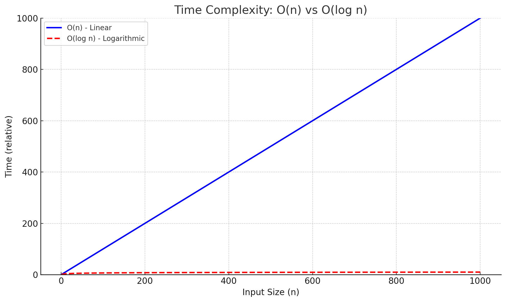

# Chapter 1 計算量とは

## 1.1 計算量オーダーとは？
計算量オーダー（Big-O表記）は、アルゴリズムやプログラムの性能を評価する重要な指標の一つです。特に入力データが大きくなったときに、実行時間やメモリ使用量がどのように増加するかを表現します。ソフトウェア開発や競技プログラミング、情報科学の分野で広く使われています。

## 1.2 代表的な計算量の種類
計算量オーダーにはいくつか代表的な種類があります。以下に主要なものを示します。

### O(1) : 定数時間
入力サイズに関係なく一定時間で終わる。

例）配列の要素を1つ取得

```cpp
const int size = 5;
int arr[size] = {10, 20, 30, 40, 50};

// 配列のインデックス2の要素に定数時間でアクセス
int value = arr[2];

// 結果を出力
std::cout << "配列のインデックス2の要素は: " << value << std::endl;
```

### O(n) : 線形時間
データが増えるとそのまま実行時間が比例して増える。

例）線形探索（全件検索）
```cpp
 // 検索対象の配列と探索する要素（ターゲット値）を定義
int arr[] = {10, 20, 30, 40, 50};
const int size = sizeof(arr) / sizeof(arr[0]);
int target = 40;

// 線形探索の実装
bool found = false;  // ターゲットが見つかったかどうかのフラグ
int index = -1;      // ターゲットの位置（初期値は見つからなかった場合）

// 配列の各要素を順にチェック
for (int i = 0; i < size; i++) {
    if (arr[i] == target) {
        found = true;
        index = i;  // ターゲットを発見した位置を記録
        break;      // ターゲットが見つかったのでループを終了
    }
}

// 結果の出力
if (found) {
    cout << "ターゲット " << target << " は配列のインデックス " << index << " に存在します。" << endl;
} else {
    cout << "ターゲット " << target << " は配列内に存在しません。" << endl;
}
```

### O(log n) : 対数時間
データが倍になるごとに処理回数が1回増える。`O(n)`の計算量のアルゴリズムを改善する場合は`O(log n)`を目指すことになります。
次の図はO(n)とO(log n)の計算量を比較するグラフです。

</img>計算量オーダーを比較するグラフ</br>

`O(n)`の計算量の場合、1000個のデータからの検索で最悪の場合で1000回の計算量になるのですが、`O(log n)`の場合は`log₂(1000)` ≒ `9.97`と最悪の計算量でも10回に満たない計算量になります。
この差はデータ数が増えるとさらに大きく開いていきます。`O(log n)`のアルゴリズムであれば、例えばデータ数が1億個の場合でも`log₂(100,000,000)` ≒ `26.5`とわずか26回の計算量で検索することができます。

例）二分木を使った２分探索

```cpp
#include <iostream>
using namespace std;

// 二分探索木のノード構造体
struct TreeNode {
    int data;
    TreeNode *left;
    TreeNode *right;
    
    // コンストラクタで初期化
    TreeNode(int val) : data(val), left(nullptr), right(nullptr) {}
};

// BST に新しい値を挿入する関数（再帰的に実装）
TreeNode* insert(TreeNode* root, int value) {
    // 空の位置に来たら新しいノードを作成
    if (root == nullptr) {
        return new TreeNode(value);
    }
    // 挿入する値が現在のノードより小さい場合は左部分木へ
    if (value < root->data) {
        root->left = insert(root->left, value);
    }
    // 挿入する値が現在のノードより大きい場合は右部分木へ
    else {
        root->right = insert(root->right, value);
    }
    return root;
}

// BST から指定した値を探索する関数（再帰的に実装）
// 見つかった場合は該当ノードのポインタ、見つからなければ nullptr を返す
TreeNode* search(TreeNode* root, int target) {
    if (root == nullptr || root->data == target) {
        return root;
    }
    // ターゲットが現在のノードより小さい場合は左部分木へ
    if (target < root->data) {
        return search(root->left, target);
    }
    // ターゲットが現在のノードより大きい場合は右部分木へ
    return search(root->right, target);
}

int main() {
    TreeNode* root = nullptr;
    
    // BST の構築
    int values[] = {30, 20, 40, 10, 25, 35, 50};
    int n = sizeof(values) / sizeof(values[0]);
    for (int i = 0; i < n; i++) {
        root = insert(root, values[i]);
    }
    
    // 探索する値の設定
    int target = 25;
    TreeNode* foundNode = search(root, target);
    
    if (foundNode != nullptr) {
        cout << "値 " << target << " は二分探索木内に存在します（ノードの値: " 
             << foundNode->data << "）。" << endl;
    } else {
        cout << "値 " << target << " は二分探索木内に存在しません。" << endl;
    }
    
    // 簡単なサンプルのため、動的確保したメモリの解放は省略しています。
    return 0;
}
```

2分木のデータ構造は次のようになります。左側には木のルート（30）より小さい数値が記憶されています。右側には30より大きい数値が記憶されています。

```
          30
         /  \
       20    40
      /  \   / \
    10   25 35  50
```

このデータ構造から25という数値を検索する場合は、次のような流れになります。

```
                   [30]
                    |
         ------------------------
         |                      |
        (25 < 30)           (不採用)
         |                      
       [20]
         |
  -----------------
  |               |
(不採用)        [25] <- ターゲット発見
  |               |
(10)           (結果成立)

```
このように、一度の比較で半分の要素を検索対象から破棄することができるため、非常に大きなデータベースに対して検索をかけるときに最良のアルゴリズムとなります。

### O(n²) : 二次時間
O(n²) というのは、「処理にかかる時間が、データ数の2乗に比例して増えていきます。

n が 2 → かかる量は 2² = 4 回分
n が 10 → 10² = 100 回分
n が 100 → 100² = 10,000 回分！
n が 1000 → 1000² = 1,000,000 回分！！

このようにデータ数が少ないときは問題は起きないのですが、データ量が増えていくと爆発的に計算量が増加していくため注意が必要なアルゴリズムです。
この処理を改善する場合は`O( n log n)`の計算量を目指していくことになります。

例）2重ループ、バブルソート
```cpp
// バブルソート関数
void bubbleSort(int arr[], int n) {
    for (int i = 0; i < n - 1; i++) {
        // 最後の i 個は既にソート済みなので無視してOK
        for (int j = 0; j < n - i - 1; j++) {
            // 隣同士を比較して入れ替え
            if (arr[j] > arr[j + 1]) {
                // swap
                int temp = arr[j];
                arr[j] = arr[j + 1];
                arr[j + 1] = temp;
            }
        }
    }
}
```

### O(n log n) : 線形対数時間
現実的に最速のソートアルゴリズムの計算量。`O(n²)`のアルゴリズムを改善する場合は`o( n log n)`を目指すこととなります。
下記の図は`O(n²)`と`o( n log n)`の計算量を比較するグラフです。

</img>計算量オーダーを比較するグラフ</br>

`O(n²)`（青線）は、nが1000に近づくと計算量は100万まで到達しています。
一方`o( n log n)`は`log₂(1000)×1000` ≒ `9965.7`となり計算量が1/100程度の計算量となっています。

例）マージソート
```cpp
// 配列をマージする関数（2つのソート済み部分を1つに統合）
void merge(int arr[], int left, int mid, int right) {
    int n1 = mid - left + 1;  // 左側の長さ
    int n2 = right - mid;     // 右側の長さ

    // 一時配列を作成
    int L[n1], R[n2];

    // 左右に値をコピー
    for (int i = 0; i < n1; i++) L[i] = arr[left + i];
    for (int j = 0; j < n2; j++) R[j] = arr[mid + 1 + j];

    // マージ処理
    int i = 0, j = 0, k = left;
    while (i < n1 && j < n2) {
        if (L[i] <= R[j]) {
            arr[k++] = L[i++];
        } else {
            arr[k++] = R[j++];
        }
    }

    // 残り要素をコピー（どちらか片方のみ）
    while (i < n1) arr[k++] = L[i++];
    while (j < n2) arr[k++] = R[j++];
}

// 再帰的にマージソートを行う関数
void mergeSort(int arr[], int left, int right) {
    if (left < right) {
        int mid = left + (right - left) / 2;

        // 左右に分割
        mergeSort(arr, left, mid);
        mergeSort(arr, mid + 1, right);

        // マージ（統合）
        merge(arr, left, mid, right);
    }
}
```


### 1.3 全探索アルゴリズムを試してみる

Sample_01_00/Sample_01_00.slnを開いて全探索アルゴリズムの`O(n)`の計算時間を確認してみてください。

### 1.4 二分探索アルゴリズムを試してみる
Sample_01_01/Sample_01_01.slnを開いて二分探索アルゴリズムの`O(log n)`の計算時間を確認してみてください。

### 1.5 バブルソートを試してみる
Sample_01_02/Sample_01_02.slnを開いてアルゴリズムの`O(n²)`の計算時間を確認してみてください。

### 1.6 マージソートを試してみる
Sample_01_03/Sample_01_03.slnを開いてアルゴリズムの`O(n log n )`の計算時間を確認してみてください。

# Chapter 2 Standard Template Library

## 2.1 Standard Template Libraryとは
C++のStandard Template Library（STL）は、C++の標準ライブラリの一部で、データ構造やアルゴリズムを効率的に提供するために設計された汎用的なテンプレートライブラリです。STLは、プログラムの効率性や再利用性を高めるために、多くの便利なコンテナ、アルゴリズム、イテレータを提供しています。STLは、C++のプログラミングの強力な要素の一つであり、特に複雑なデータ構造やアルゴリズムを手軽に利用できる点で大きな利点を持っています。

## 2.2 STLの主要な要素
STLは、以下の主要な3つのコンポーネントから構成されています。

### 2.2.1 コンテナ（Containers）
コンテナはデータを格納するためのオブジェクトで、STLには様々な種類のコンテナが存在します。主なコンテナは以下の通りです：


ベクター（std::vector）: 動的配列であり、サイズが変更可能なコンテナです。ランダムアクセスが高速で、要素の追加・削除が効率的です。

リスト（std::list）: 双方向リンクリストです。要素の挿入や削除は高速ですが、ランダムアクセスには向いていません。

デック（std::deque）: 両端キューで、両端からの要素の追加・削除が効率的です。中央の要素にはランダムアクセスできます。

セット（std::set）: 重複しない要素を保持する集合です。要素は自動的にソートされ、検索、挿入、削除が効率的に行えます。

マップ（std::map）: キーと値のペアを保持する連想コンテナです。キーがソートされ、効率的に検索や挿入が行えます。

スタック（std::stack）: LIFO（後入れ先出し）方式のコンテナです。pushやpopの操作が高速です。

キュー（std::queue）: FIFO（先入れ先出し）方式のコンテナで、pushとpop操作が効率的です。

### 2.2.2 アルゴリズム（Algorithms）
STLには、コンテナの要素を操作するためのアルゴリズムも多数提供されています。これらのアルゴリズムは、コンテナと独立して動作し、再利用可能なコードを提供します。代表的なアルゴリズムには以下が含まれます：

ソート（std::sort）: コンテナ内の要素をソートするアルゴリズムです。

検索（std::find）: コンテナ内の要素を検索します。

コピー（std::copy）: コンテナの要素を別の場所にコピーします。

変換（std::transform）: コンテナ内の各要素に対して関数を適用するアルゴリズムです。

合計（std::accumulate）: コンテナ内の要素の合計を計算するアルゴリズムです。

これらのアルゴリズムは、C++の汎用的な操作を提供し、コンテナの種類に依存せず、異なるデータ構造で同じ操作を実行できるように設計されています。

### 2.2.3 イテレータ（Iterators）
イテレータは、STLコンテナの要素を反復処理するためのオブジェクトです。イテレータはポインタのように振る舞い、コンテナの各要素を順番にアクセスするために使用されます。イテレータを使用することで、アルゴリズムとコンテナが密結合せずに、汎用的なコードを書くことができます。

イテレータには主に以下の種類があります：

入力イテレータ: 順方向に1回だけ読み取ることができます。

出力イテレータ: 順方向に1回だけ書き込むことができます。

双方向イテレータ: 順方向・逆方向に読み書きできます。

ランダムアクセスイテレータ: ポインタと同じように任意の位置にランダムアクセスできます。


## 2.3【コンテナ】std::array(セキュアな固定配列)

### 2.3.1 std::array（セキュアな固定配列）とは
`std::array`は、C++11から導入されたSTL（Standard Template Library）の一部で、固定サイズの配列をラップしたテンプレートクラスです。C言語の配列（int arr[10]など）のように、サイズが固定されている点は同じですが、STLコンテナの一つとして設計されているため、より安全で直感的な操作が可能になっています。Cスタイル配列では、要素数を超えたアクセスをしてもコンパイルエラーにならず、実行時エラーや未定義動作の原因になることがありますが、`std::array`はそのようなミスを減らす機能を持っています。また、`std::array`はSTLアルゴリズムとの相性も良く、範囲for文や`std::sort`、`std::accumulate`などを自然に使うことができます。


### 2.3.2 std::arrayの基本概念
`std::array`は、テンプレートとして定義されており、std::array<T, N>のように使います。ここでTは要素の型、Nは要素数です。たとえば、`std::array<int, 5>`は、5個のint型要素を持つ固定配列です。これは内部的にT arr[N]というCスタイル配列を保持していますが、それに加えてSTL互換のインターフェースが提供されている点が大きな違いです。

初期化は次のように記述できます。
```cpp
std::array<int, 3> arr = {1, 2, 3};
```
要素へのアクセスは、`arr[0]`や`arr.at(0)`で可能です。`at()`を使うと、範囲外アクセスに対して例外（`std::out_of_range`）が投げられるため、安全性が向上します。

### 2.3.3 std::arrayの特徴
#### 固定サイズで効率的
std::arrayはサイズがコンパイル時に確定するため、動的メモリ確保が発生せず、高速かつメモリ効率が良いです。

#### STLとの親和性
std::begin()やstd::end()といった関数が使えるので、std::sort(arr.begin(), arr.end())のようなSTLアルゴリズムと自然に組み合わせることができます。

#### 値セマンティクスに対応
　Cスタイル配列とは異なり、std::arrayはコピーや代入、関数の引数・戻り値として利用可能です。

#### 安全性の高いアクセス
　at()メソッドを使うことで、範囲外アクセスに対して例外処理を適用できます。

#### サイズ情報の保持
　C配列とは異なり、arr.size()で要素数を取得できます。

### 2.3.4 std::array vs C言語の生配列（普通の固定長配列）
さて、`std::array`はC言語の生配列と同等の振る舞いをし、かつセキュアな操作や便利な関数を保持しています。では、`std::array`とC言語の配列とでパフォーマンス的な差はあるのでしょうか？

結論から言うと実質的なパフォーマンス差はほぼなく、最適化されれば`std::array`とC配列は同等のパフォーマンスになります。
理由としては、`std::array`はC言語の配列のラッパーに過ぎないため、最適化されると普通の配列と同等のコードが出力されます。

std::array<T, N>の内部実装は、ざっくり言うと下記のようになっています。
```cpp
template<typename T, std::size_t N>
struct array {
    T elems[N];
};
```

つまり、中身は完全にC配列。余計なポインタやヒープメモリは使われません。
std::arrayの各種関数もテンプレート関数となっているため、全てインライン展開され関数呼び出しのオーバーヘッドも存在しません。


### 2.3.5 std::arrayの操作
std::arrayは以下のような操作が可能です。

#### 要素アクセス
arr[i]、arr.at(i)を利用することでアクセスできます。

```cpp
#include <array>
#include <iostream>

int main() {
    std::array<int, 3> arr = {10, 20, 30};

    std::cout << "arr[0]: " << arr[0] << std::endl;         // インデックスアクセス
    std::cout << "arr.at(1): " << arr.at(1) << std::endl;   // 範囲チェック付き
    return 0;
}

```

#### サイズの取得
arr.size()で要素数を取得できます。
```cpp
#include <array>
#include <iostream>

int main() {
    std::array<int, 5> arr = {1, 2, 3, 4, 5};

    std::cout << "size(): " << arr.size() << std::endl;
    return 0;
}
```

#### 初期化と代入
配列全体をarr.fill(value)で一括代入したり、コピーや代入演算子で別の配列と交換したりできます。
```cpp
#include <array>
#include <iostream>

int main() {
    std::array<int, 4> arr;
    arr.fill(42);  // すべての要素に42を代入

    std::array<int, 4> arr2 = {1, 2, 3, 4};
    arr = arr2;  // 配列の代入

    for (int val : arr) {
        std::cout << val << " ";
    }

    return 0;
}

```

#### イテレータ取得
arr.begin()、arr.end()、arr.rbegin()（逆順）など、通常のSTLイテレータ操作が可能です。
```cpp
#include <array>
#include <iostream>

int main() {
    std::array<int, 3> arr = {100, 200, 300};

    // 通常のイテレータ
    for (auto it = arr.begin(); it != arr.end(); ++it) {
        std::cout << *it << " ";
    }
    std::cout << std::endl;

    // 逆順のイテレータ
    for (auto rit = arr.rbegin(); rit != arr.rend(); ++rit) {
        std::cout << *rit << " ";
    }

    return 0;
}
```

#### ソート・検索など
STLのアルゴリズムをそのまま使用可能です。

```cpp
std::sort(arr.begin(), arr.end());
auto it = std::find(arr.begin(), arr.end(), 3);

```
### 2.3.6 まとめ
`std::array`は、C++における「固定長配列の安全で効率的な使い方」を提供する重要なツールです。C配列のような軽さを保ちつつ、STLの恩恵（イテレータ、安全なアクセス、値セマンティクスなど）を享受できるため、多くの場面で活用できます。ただし、サイズが固定されている点は変えられない制約なので、用途に応じて`std::vector`などとの使い分けが重要です。使い慣れることで、より安全かつ効率的なコードを書く手助けとなります。

### 2.3.7 【ハンズオン】std::arrayを使ってみる
ではstd::arrayを利用するハンズオン演習を行っていきましょう。
Sample_02_00/Sample_02_00.slnを開いてmain.cppを開いてください。
#### step-1 arrayをインクルードする
まずは、std::arrayを利用するためにはarrayをインクルードする必要があります。
下記のコードを該当するコメントの箇所に入力してください。
```cpp
// step-1 arrayをインクルードする
#include <array>
```
#### step-2 int型の要素数5のstd::arrayの変数を定義する
続いて、std::array型の変数hogeを定義します。
下記のコードを入力してください。
```cpp
// step-2 int型の要素数5のstd::arrayの変数を定義する
std::array<int, 5> hoge;
```

#### step-3 hogeに値を代入する
hogeの定義ができたので、hogeに値を代入しましょう。
次のコードを入力してください。
なお、ここでは要素のアクセスにC言語の生配列と同等の書き方ができる添え字演算子を利用しています。
```cpp
// step-3 hogeに値を代入する
hoge[0] = 10;
hoge[1] = 20;
hoge[2] = 30;
hoge[3] = 40;
hoge[4] = 50;
```

#### step-4 hogeの値を表示する
続いてhogeの値を表示しましょう。
```cpp
 // step-4 hogeの値を表示する
 for (int i = 0; i < hoge.size(); i++) {
     std::cout << hoge[i] << "\n";
 }
```
#### step-5 最後に範囲外アクセスを起こして例外を起こしてみる
最後に、このコードは不具合を生みますがhogeに対して不正なアクセスを起こすコードを書いてみましょう。
このコードは実行時に範囲外アクセスの例外をだしてクラッシュします（Debugモード時のみ）。
```cpp
// step-5 最後に範囲外アクセスを起こして例外を起こしてみる。
hoge[5] = 10;
```

#### なぜクラッシュする方がセキュアなの？
さて、最後にあえてクラッシュするコードを記述しましたが、なぜクラッシュする方が安全なのでしょうか？
クラッシュされると逆に困るんじゃない？クラッシュしない方がいいんじゃない？と思った人も多いと思います。
C言語の生配列を使っていると、このような場面でクラッシュしないかもしれません。しかし、多くの場面ではクラッシュしない方が大きな問題となります。

クラッシュしないということは、プログラムがエラーに気づかずにそのまま実行を続けてしまうということを意味します。これは、バグが隠れたまま動作し続ける可能性があり、後になって別の箇所で予期しない挙動や深刻なセキュリティホールにつながる危険性があります。特に配列の範囲外アクセスでは、他の重要なメモリ領域に不正にアクセスしてしまうことがあり、たとえば未定義動作を引き起こしたり、意図しないデータを壊したりする原因になります。

一方で、std::array::at()のような安全なメソッドを使えば、範囲外アクセス時に即座にstd::out_of_range例外が発生し、プログラムを強制終了させることができます。これは「失敗に早く気づく」ための設計であり、デバッグの段階で問題の存在を明らかにしやすくなります。また、例外をキャッチして適切に処理することもできるため、制御された方法で安全に失敗させることが可能です。

つまり、「クラッシュ＝悪」ではなく、「黙って誤動作する方がもっと悪」なのです。
その意味で、std::arrayのようなモダンなC++の機能は、開発者がより安全で堅牢なコードを書くための強力な道具となります。安全性を犠牲にして一見うまく動いているように見えるコードよりも、問題があれば即座に検出・対応できるコードの方が、結果的にセキュアで信頼性の高いシステムを構築できます。

## 2.4 【コンテナ】std::vector(動的配列)

### 2.4.1 std::vector（動的配列）とは

C++のStandard Template Library（STL）の`std::vector`は、動的配列（可変長配列）を実現するためのコンテナです。`std::vector`は、サイズが変更可能な配列として、多くのC++プログラムで使用されています。その主な特徴は、要素数が動的に変化でき、追加や削除が効率的に行えることです。また、ランダムアクセスが高速で、メモリ管理が内部で自動的に行われるため、非常に便利で使いやすいデータ構造です。

### 2.4.2 std::vectorの基本概念
`std::vector`は、C++のSTLコンテナの一つで、動的配列の役割を果たします。動的配列とは、要素数が事前に決められていない配列で、サイズが必要に応じて変更できます。これにより、サイズが固定されている通常の配列（C++のarrayやCの配列）よりも柔軟で使いやすくなります。

例えば、`std::vector<int>`は整数型の動的配列を表し、プログラムの実行中に要素を追加したり削除したりすることができます。また、std::vectorの要素は連続したメモリ領域に格納されるため、ランダムアクセスが高速です。

### 2.4.3 std::vectorの主な特長
2.1 動的サイズ
`std::vector`の最も重要な特徴は、要素数を動的に変更できる点です。初期状態では、`std::vector`は空の状態で作成され、必要に応じて要素を追加していくことができます。要素を追加する際に、内部でメモリが再割り当てされることがあります。

```cpp
std::vector<int> vec;  // 空のベクターを作成
vec.push_back(10);      // 10をベクターに追加
vec.push_back(20);      // 20をベクターに追加
```

### 2.4.4 ランダムアクセス
`std::vector`の要素は、配列と同じようにインデックスを使ってランダムアクセスすることができます。これは、`std::vector`が連続したメモリ領域に要素を格納しているため、インデックス指定で高速にアクセスできるからです。

```cpp
std::vector<int> vec = {1, 2, 3, 4, 5};
std::cout << vec[2] << std::endl;  // 3が出力される
```
ランダムアクセスの時間計算量はO(1)で、非常に高速です。

## 2.4.5 可変長
std::vectorは、サイズが動的に変わることを前提としています。最初に作成した際に要素数を指定することはできますが、その後で要素を追加・削除することができます。

```cpp
std::vector<int> vec(10);  // 10個の要素で初期化されたベクター
vec.push_back(20);         // ベクターの末尾に20を追加
```


### 2.4.6 自動メモリ管理
`std::vector`は、メモリを自動的に管理します。開発者は、`push_back`などで要素を追加したり、`resize`でサイズを変更したりする際に、メモリの管理について心配する必要はありません。内部で必要なメモリを確保・解放し、最適化も行われます。

例えば、要素数が多くなると、`std::vector`は内部の配列のサイズを倍増させて新しいメモリを確保し、要素をコピーします。これにより、頻繁にサイズ変更が必要な場合でも、効率的にメモリが管理されます。

### 2.4.7 自動メモリ管理の注意点

`std::vector`は自動的にメモリを確保・解放するコンテナであり、動的配列として振る舞います。
要素数が増加するとメモリの再確保（リサイズ）が行われるため、手動でのメモリ管理が不要ですが、
いくつかの注意点があります。
#### メモリの再確保（Reallocation）
`std::vector`は要素を追加 (`push_back` や `emplace_back`) する際に、必要に応じて新しいメモリ領域を確保し、既存要素を移動します。
例えば、容量が足りなくなると、新しい容量を確保し、すべての要素を新しい領域へコピーします。
これはコストが高くなる可能性があります。

#### reserve() の活用
追加する要素数が事前にわかっている場合、reserve(n) を使って容量を確保すると、再確保の回数を減らせるため、パフォーマンス向上につながります。
```cpp
std::vector<int> vec;
vec.reserve(1000);  // 1000個の要素分のメモリを確保
```

#### イテレータの無効化
メモリの再確保が発生すると、既存の要素が新しいメモリ領域に移動するため、以前のポインタやイテレータは無効化 されます。再確保後に無効なイテレータを使用すると 未定義動作 となるので注意が必要です。
```cpp
std::vector<int> vec = {1, 2, 3};
auto it = vec.begin();
vec.push_back(4);  // 再確保の可能性あり
// *it は未定義動作になる可能性がある
```

#### メモリリークのリスク
`std::vector`に ポインタを格納 する場合は、明示的なメモリ解放が必要 です。`vector`自体はポインタを管理しないため、ポインタの指すオブジェクトは解放されません。

```cpp
std::vector<int*> ptrs;
ptrs.push_back(new int(10));
ptrs.push_back(new int(20));

// メモリリークを防ぐために解放する
for (int* p : ptrs) {
    delete p;
}
ptrs.clear();
```
このような問題は`std::unique_ptr`などのスマートポインタを利用することで回避することができます。
```cpp
std::vector<std::unique_ptr<int>> ptrs;
ptrs.push_back(std::make_unique<int>(10)); // 自動的に管理される
```

### 2.4.7 std::vectorの操作
#### 要素の追加
std::vectorに要素を追加する方法にはいくつかあります。最もよく使われるのはpush_backです。push_backはベクターの末尾に要素を追加します。

```cpp
std::vector<int> vec;
vec.push_back(10);  // ベクターの末尾に10を追加
vec.push_back(20);  // ベクターの末尾に20を追加
```
push_backは要素を1つずつ追加しますが、内部でメモリ再確保を行うこともあります。

#### 要素の削除
要素を削除する方法として、`pop_back`を使用します。`pop_back`はベクターの末尾から要素を削除します。
```cpp
vec.pop_back();  // ベクターの末尾の要素を削除
```
また、特定の位置の要素を削除する場合は、eraseを使用します。
```cpp
vec.erase(vec.begin() + 2);  // 3番目の要素を削除
```
**erase関数の注意点**

std::vectorのerase()は、指定した要素を削除すると、その要素以降のすべての要素が前に詰められ、元のイテレーターは無効になります。
無効になったイテレーターを使い続けると、**未定義動作(バグやクラッシュ)** になります。

**危険なコード（NG）**
```cpp
#include <vector>
#include <iostream>

int main() {
    std::vector<int> vec = {1, 2, 3, 4, 5};

    for (auto it = vec.begin(); it != vec.end(); ++it) {
        if (*it % 2 == 0) {
            vec.erase(it);  // ❌ itが無効になる
        }
    }

    // 未定義動作：無効なイテレーターでループを続けてしまう
}
```

**安全なコード(eraseの戻り値を使う)**
```cpp
#include <vector>
#include <iostream>

int main() {
    std::vector<int> vec = {1, 2, 3, 4, 5};

    for (auto it = vec.begin(); it != vec.end(); ) {
        if (*it % 2 == 0) {
            it = vec.erase(it);  // ✅ eraseの戻り値でイテレーターを更新
        } else {
            ++it;
        }
    }

    for (int v : vec) {
        std::cout << v << " ";
    }

    return 0;
}
```

**removeイディオムを利用した削除の方法**
下記のようなコードを書くことで、先ほどのeraseと同等の処理を安短いコードで書くこともできます。
```cpp
auto new_end = std::remove_if(vec.begin(), vec.end(),
                              [](int x) { return x % 2 == 0; });
vec.erase(new_end, vec.end());
```


#### 要素へのアクセス

`std::vector`の要素には、インデックスを使ってアクセスできます。インデックス演算子（[]）を使うことで、直接アクセスできます。

```cpp
std::vector<int> vec = {1, 2, 3, 4, 5};
std::cout << vec[0] << std::endl;  // 1が出力される
```
また、安全にアクセスする場合には、`at`メソッドを使用します。`at`はインデックスが範囲外の場合に例外（`std::out_of_range`）を投げるため、安全性が確保されます。

```cpp
std::cout << vec.at(2) << std::endl;  // 3が出力される
```


#### サイズの変更
`std::vector`のサイズを変更するためには、`resize`メソッドを使用します。`resize`を使うと、指定したサイズにベクターを変更できます。
```cpp
vec.resize(7);  // ベクターのサイズを7に変更（不足分はデフォルト値で埋められる）
```
`resize`を使うと、必要に応じて要素が追加されますが、指定したサイズが現在のサイズよりも小さい場合は、末尾の要素が削除されます。

### 2.4.8 std::vectorの性能
`std::vector`は、動的配列のため、要素の追加や削除に関して非常に効率的です。特に末尾への追加は非常に高速で、ほとんどのケースで定数時間（O(1)）で行えます。しかし、途中の位置に挿入や削除を行う場合は、他の要素をシフトする必要があるため、性能が低下します。これにより、挿入や削除の計算量はO(n)となります。

また、`std::vector`は、要素のランダムアクセスが非常に高速であるため、アクセス時間はO(1)となり、大規模なデータでも高速にアクセスできます。

### 2.4.9 まとめ
`std::vector`は、C++のSTLコンテナの中でも非常に多くの場面で利用される、柔軟で強力なデータ構造です。動的配列として、サイズが変更可能であり、ランダムアクセスが高速です。要素の追加や削除も効率的に行え、メモリ管理が自動で行われるため、開発者にとって非常に扱いやすいコンテナです。`std::vector`は、特にサイズ変更が頻繁に発生する場合や、大規模なデータの操作が必要な場合に非常に有用です。

### 2.4.10 【ハンズオン】std::vectorを使ってみる
では、`std::vector`を使ってみましょう。Sample_02_01を立ち上げてください。
立ち上がったら、main.cppを開いてください。

### step-1 vectorをインクルード
vectorを利用するためには、まずインクルードを行う必要があります。main.cppにリスト2.1のプログラムを入力してください。</br>
[リスト2.1]</br>

```cpp
//step-1 vectorをインクルード
#include <vector>
```

### step-2 int型の要素を記録できる可変長配列を定義する。
続いて、int型の要素を記録できる可変長配列を定義します。main.cppにリスト2.2のプログラムを入力してください。</br>
[リスト2.2]</br>

```cpp
//step-2 int型の要素を記録できる可変長配列を定義する。
std::vector<int> hoge;
```

#### step-3 hogeに要素を追加する
続いて、hogeに要素を追加します。要素の追加はpush_back()関数を利用します。main.cppにリスト2.3のプログラムを入力してください。</br>
[リスト2.3]</br>

```cpp
//step-3 hogeに要素を追加する
hoge.push_back(10); //配列の末尾に10を追加する。
hoge.push_back(20); //配列の末尾に20を追加する。
hoge.push_back(30); //配列の末尾に30を追加する。
```

#### step-4 hogeのサイズを表示する。
さて、step-3でhogeにint型のデータを3つ追加しました。ですので、可変長配列hogeのサイズは3になっているはずです。可変長配列のサイズはsize()関数で取得することができます。</br>
では、本当にhogeのサイズが3になっているか確認してみましょう。main.cppにリスト2.4のプログラムを入力して下さい。
[リスト2.4]</br>

```cpp
//step-4 hogeのサイズを表示する。
std::cout << "hogeのサイズは" << hoge.size() << "です。\n";
```

#### step-5 for文を使って、hogeの要素の値を表示する。
可変長配列は、固定長配列と同じように添え字演算子、[]を利用してアクセスすることができます。では、for文で回して、hogeの各要素を表示してみましょう。</br>
main.cppにリスト2.5のプログラムを入力してください。</br>
[リスト2.5]</br>

```cpp
//step-5 for文を使って、hogeの要素の値を表示する。
for (int i = 0; i < hoge.size(); i++) {
    std::cout 
        << "hoge["
        << i 
        << "]の値は" 
        << hoge[i] 
        << "です。\n";
}
```

では、ここまでで一度実行してみて下さい。図2.2のように表示されていたら実装できています。</br>
[図2.2]</br>
</img></br>

#### step-6 さらにhogeに要素を追加する。
step-6では更にhogeに要素を追加してみましょう。main.cppにリスト2.6のプログラムを入力して下さい。</br>
[リスト2.6]</br>

```cpp
//step-6 さらにhogeに要素を追加する。
hoge.push_back(40);
hoge.push_back(50);
```

#### step-7 再度hogeのサイズを表示する。
step-6でhogeに要素を２つ追加したので、hogeの要素数は5になっているはずです。では、再度hogeのサイズを表示するプログラムを追加しましょう。</br>
main.cppにリスト2.7のプログラムを入力してください。</br>
[リスト2.7]
```cpp
//step-7 再度hogeのサイズを表示する。
std::cout << "hogeのサイズは" << hoge.size() << "です。\n";
```

#### step-8 もう一度for文を使って、hogeの要素の値を表示する。
では、最後にもう一度for文を使ってhogeの要素の値を表示してみましょう。main.cppにリスト2.8のプログラムを入力してください。</br>
[リスト2.8]
```cpp
//step-8 もう一度for文を使って、hogeの要素の値を表示する。
for (int i = 0; i < hoge.size(); i++) {
    std::cout
        << "hoge["
        << i
        << "]の値は"
        << hoge[i]
        << "です。\n";
}
```

入力出来たら実行してみてください。図2.3のように表示されていたら実装できています。</br>
[図2.3]</br>
</img></br>

#### int型以外も記録できるの？
vectorクラスはテンプレートクラスとなっているため、int型以外の値も記録できます。float型を記録できる可変長配列を定義して、利用するコードを下記に示します。</br>

```cpp
std::vector<float> hoge;
hoge.push_back(10.0f);
hoge.push_back(20.0f);
hoge.push_back(30.0f);
```

vectorクラスはintやfloatのような組み込み型だけではなく、ユーザー定義のクラスでも利用できます。下記のコードはMatrixクラスのオブジェクトの値を記録しているコードです。</br>

```cpp
Matrix m0, m1, m2;
 　・
  省略
 　・
std::vector<Matrix> hoge;
hoge.push_back( m0 );
hoge.push_back( m1 );
hoge.push_back( m2 );
```

## 1.4 アルゴリズム

---------------------------------------------------------------------------------------------------------------------------------------------


## 1.1 Standard Template Libraryとは
C++標準テンプレートライブラリとは、C++のプログラミングを楽にするための強力なライブラリです。その中でもこのチャプターでは以下の3つについて取り上げます。</br>
1. vector(可変長配列)
2. list(双方向リスト)
3. map(連想配列)

これらのクラスは、STLと呼ばれる標準テンプレートライブラリの一部であり、ゲーム開発などで非常に有用です。このクラスは基本的に同様の関数を備えているため、1つのクラスを理解すれば、他のクラスの使用方法も簡単に習得できます。

それでは、これらのクラスについて学んでいきましょう。

<a href= "Chapter 2.2 可変長配列_vector.html" >Chapter 2.2 可変長配列「vector」</a></br>


## 2.2 可変長配列「vector」

vectorは要素数を動的に変化させることができる配列です。「動的」というのはプログラム実行中ということです。</br>
これまで、皆さんが勉強した配列は、固定長配列です。固定長配列はプログラムの実行中にサイズを変えることはできません。</br>
次のプログラムを読んでみてください。</br>

```cpp
int hoge[10];
 ・
 省略
 ・
for( int i = 0; i < 10; i++){
    std::cout << hoge[i];
}
```
このプログラムには配列hogeが登場していますが、この配列のサイズは10で固定です。プログラム実行中に、動的にサイズを変えることはできません。</br>
可変長配列はこのサイズをプログラム実行中に変更することができるのです。</br>
要素を追加するにはemplace_back()関数を利用します。

## 2.2.1 【ハンズオン】vectorを使ってみる。
では、習うより慣れろです。さっそくvectorを使ってみましょう。Sample_02_01を立ち上げてください。
立ち上がったら、main.cppを開いてください。

### step-1 vectorをインクルード
vectorを利用するためには、まずインクルードを行う必要があります。main.cppに次のプログラムを入力してください。</br>
```cpp
//step-1 vectorをインクルード
#include <vector>
```

### step-2 int型の要素を記録できる可変長配列を定義する。
続いて、int型の要素を記録できる可変長配列を定義します。main.cppに次のプログラムを入力してください。</br>
```cpp
//step-2 int型の要素を記録できる可変長配列を定義する。
std::vector<int> hoge;
```

### step-3 hogeに要素を追加する
続いて、hogeに要素を追加します。要素の追加はpush_back()関数を利用します。main.cppに次のプログラムを入力してください。</br>

```cpp
//step-3 hogeに要素を追加する
hoge.push_back(10); //配列の末尾に10を追加する。
hoge.push_back(20); //配列の末尾に20を追加する。
hoge.push_back(30); //配列の末尾に30を追加する。
```

### step-4 hogeのサイズを表示する。
さて、step-3でhogeにint型のデータを3つ追加しました。ですので、可変長配列hogeのサイズは3になっているはずです。可変長配列のサイズはsize()関数で取得することができます。</br>
では、本当にhogeのサイズが3になっているか確認してみましょう。main.cppに次のプログラムを入力して下さい。

```cpp
//step-4 hogeのサイズを表示する。
std::cout << "hogeのサイズは" << hoge.size() << "です。\n";
```

### step-5 for文を使って、hogeの要素の値を表示する。
可変長配列は、固定長配列と同じように添え字演算子、[]を利用してアクセスすることができます。では、for文で回して、hogeの各要素を表示してみましょう。</br>
main.cppに次のプログラムを入力してください。</br>

```cpp
//step-5 for文を使って、hogeの要素の値を表示する。
for (int i = 0; i < hoge.size(); i++) {
    std::cout 
        << "hoge["
        << i 
        << "]の値は" 
        << hoge[i] 
        << "です。\n";
}
```

では、ここまでで一度実行してみて下さい。次の図のように表示されていたら実装できています。</br>
</img></br>

### step-6 さらにhogeに要素を追加する。
step-6では更にhogeに要素を追加してみましょう。main.cppにリスト2.6のプログラムを入力して下さい。</br>
[リスト2.6]</br>

```cpp
//step-6 さらにhogeに要素を追加する。
hoge.push_back(40);
hoge.push_back(50);
```

### step-7 再度hogeのサイズを表示する。
step-6でhogeに要素を２つ追加したので、hogeの要素数は5になっているはずです。では、再度hogeのサイズを表示するプログラムを追加しましょう。</br>
main.cppにリスト2.7のプログラムを入力してください。</br>
[リスト2.7]
```cpp
//step-7 再度hogeのサイズを表示する。
std::cout << "hogeのサイズは" << hoge.size() << "です。\n";
```

### step-8 もう一度for文を使って、hogeの要素の値を表示する。
では、一度for文を使ってhogeの要素の値を表示してみましょう。main.cppにリスト2.8のプログラムを入力してください。</br>
[リスト2.8]
```cpp
//step-8 もう一度for文を使って、hogeの要素の値を表示する。
for (int i = 0; i < hoge.size(); i++) {
    std::cout
        << "hoge["
        << i
        << "]の値は"
        << hoge[i]
        << "です。\n";
}
```

入力出来たら実行してみてください。図2.3のように表示されていたら実装できています。</br>
[図2.3]</br>
</img></br>

#### step-9 指定した要素を削除する
では、最後にユーザーが入力した数値のデータを削除するプログラムを実装しましょう。
ここでは、erase関数を利用しています。
erase関数を利用した際にイテレーターが無効になる問題を意識しながらコードを入力してください。

```cpp
//step-9 指定した要素を削除する
int target;
std::cout << "削除したい数値を入力してください\n";
std::cin >> target;
// 削除する要素を指しているイテレーターを検索する
for (
    std::vector<int>::iterator it = hoge.begin();
    it != hoge.end();
    ) {
    if (*it == target) {
        // 見つかったので削除。
        // 戻り値は新しい次のイテレーターを返してくる。
        it = hoge.erase(it);
    }
    else {
        // ターゲットではなかったので次
        it++;
    }
}

// 削除後の要素を表示する
for (int i = 0; i < hoge.size(); i++) {
    std::cout
        << "hoge["
        << i
        << "]の値は"
        << hoge[i]
        << "です。\n";
}
```
入力出来たら実行してみてください。

## 2.2.1 int型以外も記録できるの？
vectorクラスはテンプレートクラスとなっているため、int型以外の値も記録できます。float型を記録できる可変長配列を定義して、利用するコードを下記に示します。</br>

```cpp
std::vector<float> hoge;
hoge.push_back(10.0f);
hoge.push_back(20.0f);
hoge.push_back(30.0f);
```

vectorクラスはintやfloatのような組み込み型だけではなく、ユーザー定義のクラスでも利用できます。下記のコードはMatrixクラスのオブジェクトの値を記録しているコードです。</br>

```cpp
Matrix m0, m1, m2;
 　・
  省略
 　・
std::vector<Matrix> hoge;
hoge.push_back( m0 );
hoge.push_back( m1 );
hoge.push_back( m2 );
```


### 2.2.2 評価テスト-3

次の評価テストを行いなさい。</br>
[評価テストへジャンプ](https://docs.google.com/forms/d/e/1FAIpQLSfsx_Emr8kf2u1nInf9b_mB8jcRCKhOnmrR8SmMShy8T1I5mA/viewform?usp=sf_link)
</br>

<div style="page-break-before:always"></div>

## 2.3 双方向リスト「list」

listは要素数を動的に変化させることができる双方向リストです。listは可変長配列のvectorと同様に、emplace_back()関数を利用することで、要素数を増やすことができます。次のプログラムを見てみてください。</br>

```cpp
std::list< int > hoge;
hoge.emplace_back( 10 );
hoge.emplace_back( 20 );
hoge.emplace_back( 30 );
```

vectorと同様にsize()関数を利用することで、要素数を取得することができます。

```cpp
std::list< int > hoge;
hoge.emplace_back( 10 );
hoge.emplace_back( 20 );
hoge.emplace_back( 30 );

std::cout << "hogeのサイズは" << hoge.size() << "です。\n";
```
### 2.3.1 listとvectorの違い
さて、要素数を動的に変化させるという点では、listとvectorは全く同じもののように思えます。この節では、listとvectorの違いについていくつか見ていきましょう。

#### listは添え字演算子が使えない。
listはvectorと違って添え字演算子が使えません。つまり、次のようなプログラムがかけないということです。

```cpp
std::list< int > hoge;
hoge.emplace_back( 10 );
hoge.emplace_back( 20 );
hoge.emplace_back( 30 );

// できないのでコンパイルエラーが起きる。
std::cout << hoge[2];
```

では、listを使っているときに要素のアクセスをどうするのか？というとイテレーター(反復子)を利用して、要素の先頭から順繰りアクセスしていきます。

```cpp
std::list< int > hoge;
hoge.emplace_back( 10 );
hoge.emplace_back( 20 );
hoge.emplace_back( 30 );

//begin()関数を使って、先頭イテレータを取得する。
std::list< int >::iterator it = hoge.begin(); 
// 10と表示される。
std::cout << *it << "\n"
// 次の要素に進む。
it++;
// 20と表示される。
std::cout << *it << "\n"
```
イテレーターはlistが格納している要素を指し示す、ポインタのようなものです。ポインタと同じように*演算子を利用して、イテレーターが指し示している要素にアクセスすることができます。</br>
また、イテレーターはlistだけではなくvectorや、この後勉強するmapなど、C++の標準ライブラリのコンテナクラスの全て利用できます。</br>


>コンテナクラスとは、listやvectorのように、要素を記憶することができるC++標準ライブラリのクラスです。</br>
>listやvector以外にも、array、deque、fowrard_list、map、multimap、unordered_map、set、multisetなどいくつか存在しています。</br>
>どのコンテナクラスにもメリット、デメリットが存在しており、必要に応じて適切なコンテナクラスを選択することが重要になってきます。</br>

イテレーターの典型的な利用方法として、for文での利用があげられます。

```cpp
std::list< int > hoge;
hoge.emplace_back( 10 );
hoge.emplace_back( 20 );
hoge.emplace_back( 30 );

// for文を使って、リストの全要素にアクセスする。
for( 
    std::list< int >::iterator it = hoge.begin();
    it != hoge.end(); // イテレーターが終端に到達するまで
    it++              // 次のイテレーターへ
){
    std::cout << *it << "\n";
}
```

#### listを使うべき場面は？
基本的にゲームにおいては、可変長配列vectorの方が多くの場面でlistより向いています。</br>
しかし、頻繁に要素の追加と削除が発生する場合に、vectorクラスの代わりに利用することを検討すべきです。</br>
この理由については、C++による大規模開発 ～C++標準テンプレートライブラリの利用(応用)～で解説します。
 

## 2.3.1 【ハンズオン】listを使ってみる。
では、習うより慣れろです。さっそくvectorを使ってみましょう。Sample_02_02を立ち上げてください。
立ち上がったら、main.cppを開いてください。

### step-1 listをインクルード
listを利用するためには、まずインクルードを行う必要があります。main.cppにリスト2.1のプログラムを入力してください。</br>
[リスト1]</br>

```cpp
//step-1 listをインクルード
#include <list>
```

### step-2 int型の要素を記録できる双方向リストを定義する。
続いて、int型の要素を記録できる可変長配列を定義します。main.cppにリスト2のプログラムを入力してください。</br>
[リスト2]</br>

```cpp
//step-2 int型の要素を記録できる双方向リストを定義する。
std::list<int> hoge;
```

### step-3 hogeに要素を追加する
続いて、hogeに要素を追加します。要素の追加はemplace_back()関数を利用します。main.cppにリスト3のプログラムを入力してください。</br>
[リスト3]</br>

```cpp
//step-3 hogeに要素を追加する
hoge.emplace_back(10); //配列の末尾に10を追加する。
hoge.emplace_back(20); //配列の末尾に20を追加する。
hoge.emplace_back(30); //配列の末尾に30を追加する。
```


### step-5 for文を使って、hogeの要素の値を表示する。
続いて、for文で回して、hogeの各要素を表示してみましょう。可変長配列と違い、添え字演算子が使えないため、イテレータを利用します。</br>
main.cppにリスト4のプログラムを入力してください。</br>
[リスト4]</br>

```cpp
// step-4 for文を使って、hogeの要素の値を表示する。
for (
    std::list<int>::iterator it = hoge.begin();
    it != hoge.end();
    it++
) {
    std::cout << *it << "\n";
}
```

では、ここまで実行してみて下さい。図2.4のように表示されていたら実装できています。</br>
[図2.4]</br>
</img></br>


### 2.3.2 評価テスト-4

次の評価テストを行いなさい。</br>
[評価テストへジャンプ](https://docs.google.com/forms/d/e/1FAIpQLScPWz97jYRB6EUHpSg3rmpQEVxHZHhpzKjkDzMwTQuJtF4_mA/viewform?usp=sf_link)
</br>

<div style="page-break-before:always"></div>

## 2.4 連想配列「map」

この節では次のプログラムを使用します。次のURLからプログラムをダウンロードしておいてください。</br>
**[Sample_02_03.zip](https://drive.google.com/file/d/1EVDWLFguYywhCzHU-9sbNFiVKRewSxB7/view?usp=sharing)**</br>


mapはキーと値付きで要素を記憶することができるコンテナクラスです。mapに格納されている要素はstd::pair型のオブジェクトです。</br>
mapにはstd::pair型のオブジェクトをinsert()関数を利用することで追加することができます。次のコードを見てください。</br>


```cpp
// 名前と年齢を記憶できる連想配列を定義する。
std::map< std::string, int > map;

// 豊臣秀吉をキー、39歳を値に持つデータを作成する。
std::pair< std::string, int > data;
data.first = "豊臣秀吉"; // firstがキー。
data.second = 39;       // secondが値。

// 作成したデータを連想配列に追加する。
map.insert( data );

// 続いて、織田信長、50歳を値に持つデータを作成する。
data.first = "織田信長";  // firstがキー。
data.second = 50;        // secondが値。

// 作成したデータを連想配列に追加する。
map.insert(data);
```

mapへの要素の追加は次のように記述することもできます。
```cpp
// 名前と年齢を記憶できる連想配列を定義する。
std::map< std::string, int > map;
// 豊臣秀吉をキー、39を値にもつデータを挿入。
map.insert( {"豊臣秀吉", 39} );
// 織田信長、50歳を値に持つデータを挿入。
map.insert( {"織田信長", 50} );
```

連想配列に記憶されている要素は、キーを使うことでアクセスすることができます。

```cpp
std::cout << map["豊臣秀吉"] << "\n"; // 39と表示される。
std::cout << map["織田信長"] << "\n"; // 50と表示される。
```

mapもイテレータを利用して、for文を回すことができます。

```cpp
for( 
    std::map< std::string, int >::iterator it = map.begin();
    it != map.end();
    it++
){
    // イテレーターはmapに格納されている要素を指しているの、std::pair型のオブジェクトを指しています。
    // なので、各要素のキーと値にアクセスすることができます。
    std::cout << "キーは" << it->first << "\n";
    std::cout << "値は" << it->second << "\n";
}
```

#### mapを使うべき場面は？
データとデータを関連付けて記憶しておきたい場合。ゲームであれば、例えば読み込み済みのリソースの記録などで利用されます。</br>
値にリソースのファイルパス、値に読み込み済みのリソースなどを記録しておき、使いまわす等の実装が行われることがあります。</br>

#### mapへのデータの挿入のされ方は？
mapへのデータの挿入の関数がemplace_back()関数ではないことに注意してください。mapにはemplace_back()関数はありません。mapはinsert()関数が用意されており、insert()関数が要素を挿入する位置はC++の使用では定義されていません。</br>
つまりどこに挿入されるか不明になっています。</br>
例えば次のコードの場合、織田信長と豊臣秀吉のデータのどちらが先に表示されるか分からないということです。</br>
```cpp
std::map< std::string, int > map;
// 豊臣秀吉をキー、39を値にもつデータを挿入。
map.insert( {"豊臣秀吉", 39} );
// 織田信長、50歳を値に持つデータを挿入。
map.insert( {"織田信長", 50} );

//　豊臣秀吉が先に表示されるわけではない！！！
for( 
    std::map< std::string, int >::iterator it = map.begin();
    it != map.end();
    it++
){
    // イテレーターはmapに格納されている要素を指しているの、std::pair型のオブジェクトを指しています。
    // なので、各要素のキーと値にアクセスすることができます。
    std::cout << "キーは" << it->first << "\n";
    std::cout << "値は" << it->second << "\n";
}
```
mapの実装のされ方は、コンパイラベンダーによって異なりますが、多くのベンダーではキーを参照しての2分木データ構造になっています。</br>
2分木構造になっている理由は、キーを使った要素へのアクセス時間を対数時間にすることができ、高速にすることができるためです。</br>
この詳細については、C++による大規模開発 ～C++標準テンプレートライブラリの利用(応用)～で解説します。


## 2.4.1 【ハンズオン】mapを使ってみる。
では、さっそくmapを使ってみましょう。Sample_02_03を立ち上げてください。
立ち上がったら、main.cppを開いてください。

### step-1 mapをインクルード
mapを利用するためには、まずインクルードを行う必要があります。main.cppにリスト1のプログラムを入力してください。</br>
[リスト1]</br>

```cpp
//step-1 mapをインクルード
#include <map>
```

### step-2 名前と年齢を記憶できる連想配列を定義する。
続いて、int型の要素を記録できる可変長配列を定義します。main.cppにリスト2のプログラムを入力してください。</br>
[リスト2]</br>

```cpp
// 名前と年齢を記憶できる連想配列を定義する。
std::map< std::string, int > map;
// 豊臣秀吉をキー、39を値にもつデータを挿入。
map.insert( {"豊臣秀吉", 39} );
// 織田信長、50歳を値に持つデータを挿入。
map.insert( {"織田信長", 50} );
```

### step-3 キーを使って要素にアクセスする。
続いて、キーを使って要素にアクセスしてみましょう。リスト3のプログラムを入力してください。</br>
[リスト3]</br>

```cpp
// step-3 キーを使って要素にアクセスする。
std::cout << map["豊臣秀吉"] << "\n"; // 39と表示される。
std::cout << map["織田信長"] << "\n"; // 50と表示される。
```


### step-4 for文を使って、mapに格納されているキーと値を表示する。
続いて、for文で回して、mapの各要素を表示してみましょう。main.cppにリスト4のプログラムを入力してください。</br>
[リスト4]</br>
```cpp
//step-4 for文を使って、mapに格納されているキーと値を表示する。
for (
    std::map< std::string, int >::iterator it = map.begin();
    it != map.end();
    it++
    ) {
    // イテレーターはmapに格納されている要素を指しているの、std::pair型のオブジェクトを指しています。
    // なので、各要素のキーと値にアクセスすることができます。
    std::cout << "キーは" << it->first << "\n";
    std::cout << "値は" << it->second << "\n";
}
```

では、ここまで実行してみて下さい。図2.4のように表示されていたら実装できています。</br>
[図2.5]</br>
</img></br>


### 2.4.2 評価テスト-5

次の評価テストを行いなさい。</br>
[評価テストへジャンプ](https://docs.google.com/forms/d/e/1FAIpQLSd1T1PNCOTHixgiPk41QAv3KOCy5oeJuptX9fpjvHy94VvvYg/viewform?usp=sf_link)
</br>

### 2.4.3 実習課題
次のプログラムをダウンロードして、プログラム中のコメントと完成動画を参考にして実習を行いなさい。
**[Question_02_01.zip](https://drive.google.com/file/d/1kCqkHddtFg1sZUlolvxnlYKKfubslUUn/view?usp=sharing)**</br>


# Chapter 3 C++による大規模開発 ～C++標準テンプレートライブラリの利用(中級)～ 

この節では次のプログラムを使用します。次のURLからプログラムをダウンロードしておいてください。</br>
**[Question_03_01.zip](https://drive.google.com/file/d/1LGtEhHOuOS7jjwH0yYlpPi7PQapXOcfk/view?usp=sharing)**</br>
**[Question_03_02.zip](https://drive.google.com/file/d/1VHrvT-xFY6iG28yL3ZBvC_Ktm6crz9cv/view?usp=sharing)**</br>

## 3.1 検索
std::find()関数を利用することで、可変長配列に記録されている要素を検索することができます。次のコードはfind()関数の利用例です。
```cpp
std::vector< int > hoge;
hoge.emplace_back(30);
hoge.emplace_back(40);
hoge.emplace_back(50);

std::vector<int>::iterator it;
// find関数は第一引数と第二引数にイテレーターを指定して、
// 検索範囲を指定する。第三引数は検索する値。
// 今回だと、hogeの先頭から終端までの範囲で、40という値を検索している。
it = std::find(
    hoge.begin(),   
    hoge.end(), 
    40 
);

if ( it == hoge.end() ) {
    // 検索対象の値が見つからなかった場合は終端のイテレーターを返してくる。
    std::cout << "見つからなかった" << "\n";
}else{
    std::cout << "見つかった" << *it << "\n";
}
```

## 3.2 要素の削除
vectorはerase()関数を利用することで、要素を削除することができます。erase()関数に削除したいイテレーターを渡すことで削除することができます。次のコードはerase()関数の利用例です。

```cpp
std::vector< int > hoge;
hoge.emplace_back(30);
hoge.emplace_back(40);
hoge.emplace_back(50);

std::vector<int>::iterator it;
// hogeから40が記録されているイテレータを検索する。
it = std::find(
    hoge.begin(),   
    hoge.end(), 
    40 
);

if ( it != hoge.end() ) {
    // 見つかったので削除
    hoge.erase( it );
}
```

## 3.2 実習課題
Question_03_01のコメントを読んで課題に取り組みなさい。


## 3.3 実習課題(上級)
Question_03_02のコメントを読んで課題に取り組みなさい。


## 3.1 検索
双方向リストは、可変長配列と同様に、std::find()関数を利用することで、リストに記録されている要素を検索することができます。次のコードはfind()関数の利用例です。
```cpp
std::list< int > hoge;
hoge.emplace_back(30);
hoge.emplace_back(40);
hoge.emplace_back(50);

std::list<int>::iterator it;
// find関数は第一引数と第二引数にイテレーターを指定して、
// 検索範囲を指定する。第三引数は検索する値。
// 今回だと、hogeの先頭から終端までの範囲で、40という値を検索している。
it = std::find(
    hoge.begin(),   
    hoge.end(), 
    40 
);

if ( it == hoge.end() ) {
    // 検索対象の値が見つからなかった場合は終端のイテレーターを返してくる。
    std::cout << "見つからなかった" << "\n";
}else{
    std::cout << "見つかった" << *it << "\n";
}
```

## 3.2 要素の削除
listは可変長配列と同様にerase()関数を利用することで、要素を削除することができます。erase()関数に削除したいイテレーターを渡すことで削除することができます。次のコードはerase()関数の利用例です。

```cpp
std::list< int > hoge;
hoge.emplace_back(30);
hoge.emplace_back(40);
hoge.emplace_back(50);

std::list<int>::iterator it;
// hogeから40が記録されているイテレータを検索する。
it = std::find(
    hoge.begin(),   
    hoge.end(), 
    40 
);

if ( it != hoge.end() ) {
    // 見つかったので削除
    hoge.erase( it );
}
```


